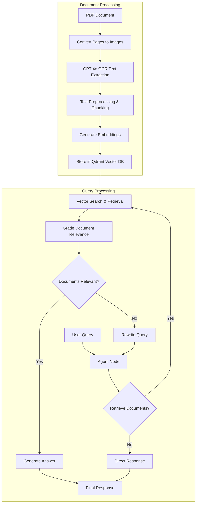

# Agentic PDF RAG System

An intelligent document analysis system that combines PDF processing, vector search, and agentic AI workflows to provide accurate answers from document content.

## Overview

This system processes PDF documents by converting them to images, extracting text using GPT-4o vision capabilities, and creating a searchable knowledge base. An intelligent agent then handles user queries by deciding when to retrieve information, evaluating document relevance, and generating accurate responses.

## Key Features

- **PDF to Text Conversion**: Uses pypdfium2 to convert PDF pages to high-quality images
- **OCR with GPT-4o**: Leverages GPT-4o vision model for accurate text extraction
- **Vector Database**: Stores embeddings in Qdrant for efficient similarity search
- **Intelligent Agent**: LangGraph-powered agent that makes smart retrieval decisions
- **Document Grading**: Automatically evaluates relevance of retrieved documents
- **Query Rewriting**: Improves queries when initial results are not relevant
- **Expanding Window Training**: Demonstrates advanced ML techniques for stock prediction

## System Architecture



## How It Works

### Document Processing
1. **PDF Conversion**: PDF pages are converted to high-resolution images
2. **Text Extraction**: GPT-4o analyzes images and extracts text content
3. **Preprocessing**: Text is cleaned, chunked, and prepared for embedding
4. **Vector Storage**: Document chunks are embedded and stored in Qdrant

### Query Processing
1. **Agent Decision**: Intelligent agent decides whether to retrieve documents
2. **Vector Search**: If needed, performs similarity search in vector database
3. **Relevance Grading**: Evaluates if retrieved documents answer the query
4. **Response Generation**: Creates final answer or rewrites query if needed

## Example Use Case

The system is demonstrated with a research paper on "Stock Price Prediction Using Hybrid LSTM-GNN Model". Users can ask questions like:

- "How is the graph constructed for the GNN component?"
- "What is the MSE of CNN in Figure 5?"
- "What are the test days with highest MSE values?"

## Technologies Used

- **LangChain**: Framework for building LLM applications
- **LangGraph**: Agent workflow orchestration
- **OpenAI GPT-4o**: Vision and text generation model
- **Qdrant**: Vector database for similarity search
- **pypdfium2**: PDF processing and image conversion
- **Python**: Core programming language

## Installation

```bash
pip install pypdfium2 backoff langchain-community langchain langchain-openai langgraph qdrant-client
```

## Configuration

Set your API keys:
```python
OPENAI_API_KEY = "your-openai-api-key"
QDRANT_API_KEY = "your-qdrant-api-key"  # Optional for local deployment
QDRANT_URL = "your-qdrant-url"          # Optional for local deployment
```

## Usage

1. Load your PDF document
2. Run the document processing pipeline
3. Start querying the system with natural language questions
4. The agent will intelligently retrieve and process relevant information

## Benefits

- **Intelligent Retrieval**: Only searches when necessary
- **Quality Control**: Validates document relevance before responding
- **Adaptive**: Improves queries automatically when initial results are poor
- **Accurate**: Combines vision-based OCR with semantic search
- **Scalable**: Vector database enables fast search across large document collections

This system demonstrates advanced RAG (Retrieval-Augmented Generation) techniques with agentic AI workflows for robust document analysis and question answering.

## Tutorial Article 
For a detailed step-by-step guide on building this system, read the full tutorial on Medium:
[**How I Built an Agentic RAG System with Qdrant to Chat with Any PDF**](https://medium.com/@mohammedarbinsibi/how-i-built-an-agentic-rag-system-with-qdrant-to-chat-with-any-pdf-4f680e93397e)


### References : 
* [LangChain](https://github.com/langchain-ai/langchain)
* [LangGraph](https://langchain-ai.github.io/langgraph/)
* [LangGraph Agentic RAG](https://github.com/langchain-ai/langgraph/blob/main/examples/rag/langgraph_agentic_rag.ipynb)
* [Qdrant documentation](https://qdrant.tech/documentation/)
* [LSTM-GNN paper](https://arxiv.org/pdf/2502.15813)
