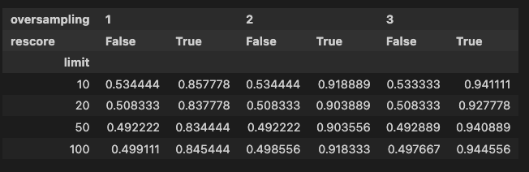

# Mistral Embed

The exploration of Mistral Embedment is driven by its unique feature of supporting multiple European languages including English, French, and German. This makes it a compelling tool for experimenting with Binary Quantization, especially considering its capability to handle multilingual content which is relatively less explored.

## Setting up the environment

In order to work with Mistral Embedment and further dependencies within a Jupyter notebook, the setup process involves leveraging a `pyproject.toml` file. This file lists all the necessary Python dependencies. Installation of these dependencies is facilitated through Poetry, a tool designed for dependency management in Python projects. The command `poetry install --no-root` specified for the terminal ensures these dependencies are installed in the environment where the Jupyter Notebook is running.

Following the installation, the code snippet proceeds to import essential Python libraries such as `json`, `os`, `loguru`, `numpy`, `pandas`, and others. These libraries serve various purposes, from handling environmental variables, logging, mathematical operations, to data manipulation. Particularly noteworthy is the import of `load_dataset` from `datasets`, and classes from `qdrant_client` which are integral for working with datasets and connecting to Qdrant, a vector database for storing and searching through embeddings.

The environmental variables critical for the application's configuration are loaded using `load_dotenv()`, ensuring any sensitive or configurable parameters are securely managed. Additionally, `loguru` is configured to record logs, facilitating debugging and monitoring of the application's performance.


Overall, the configuration and initial setup steps lay the foundational groundwork necessary for engaging in meaningful experimentation and analysis with Mistral Embedding, highlighting the importance of a structured approach to managing dependencies and environmental configurations in data science projects.

```python
import json
import os

import loguru
import numpy as np
import pandas as pd

# Code of your application, which uses environment variables (e.g. from `os.environ` or
# `os.getenv`) as if they came from the actual environment.
from datasets import load_dataset
from dotenv import load_dotenv
from qdrant_client import QdrantClient, models
from qdrant_client.models import PointStruct
from tqdm import tqdm

load_dotenv()  # take environment variables from .env.

logger = loguru.logger
logger.add("logs.log", format="{time} {level} {message}", level="INFO")
```

### Loading the Dataset

In this segment, the focus is on loading a specific dataset, which is identified as "nirantk/dbpedia-entities-google-palm-gemini-embedding-001-100K". This dataset is loaded using a function called `load_dataset`, which is a common utility in data analysis and machine learning tasks. The parameters passed to this function indicate that the dataset should not be loaded in streaming mode (`streaming=False`), and only the "train" split of the dataset is required.

The `load_dataset` function returns the dataset that is then stored in a variable named `dataset`. The output of this code snippet, which isn’t explicitly mentioned, would likely provide insight into the structure of the dataset, such as the number of records and features or dimensions. This dataset is presumably oriented toward embedding representations, as suggested by its name.

By loading this dataset, the preparatory step for any subsequent analysis, training, or exploration tasks is completed. This part is critical because it ensures that the data is accessible in a format that can be manipulated or analyzed with Python tools and libraries.

```python
dataset = load_dataset(
    "nirantk/dbpedia-entities-google-palm-gemini-embedding-001-100K",
    streaming=False,
    split="train",
)
dataset
```

### Removing Unnecessary Columns

In this section, the focus is on pre-processing the dataset to ensure it's ready for further analysis or computational tasks. Specifically, the dataset is being streamlined by removing columns that may not be necessary for the upcoming stages of the workflow. This is achieved with a simple yet effective code line which targets and removes specific columns from the dataset.

The code snippet provided:

```python
dataset = dataset.remove_columns(column_names=["embedding"])
```

demonstrates how to remove columns by name. Here, the column named "embedding" is identified as extraneous for our current purposes and is thus being removed from the dataset. This step is crucial for a couple of reasons. Firstly, it helps in reducing the memory footprint of the dataset, which can be particularly important when working with large datasets. Secondly, by removing irrelevant features or columns, it ensures the dataset is tidied up before any analysis, preventing any potential noise from interfering with the outcomes.

This operation will likely impact subsequent analyses or model training processes by ensuring that only relevant data is included, fostering both efficiency and effectiveness in data processing and analysis tasks.

```python
dataset = dataset.remove_columns(column_names=["embedding"])
```

### Preprocessing Dataset for Vector Embeddings

In this section, we focus on an essential preprocessing step aimed at optimizing the dataset for vector embeddings. The task involves combining two fields, namely 'title' and 'text', from each record in the dataset. This combination is crucial because it enriches the contextual information available for each record, which is vital for generating more accurate and meaningful vector embeddings later in the process.

The code snippet provided achieves this combination by applying a map function to the dataset. Specifically, it creates a new field called 'combined_text' for each record. This field is a concatenation of the 'title' and the 'text' fields, separated by a newline character. This approach not only preserves the original structure of each record but also enhances the dataset by creating a more descriptive representation of each entry. 

```python
dataset = dataset.map(lambda x: {"combined_text": f"{x['title']}\n{x['text']}"})
```

No direct output is shown for this code, but its significance lies in its impact on the dataset's structure and subsequent processing steps. By enriching the dataset in this manner, we lay a robust foundation for generating high-quality vector embeddings, which are instrumental in various natural language processing (NLP) tasks, including document similarity searches and topic classification.

```python
dataset = dataset.map(lambda x: {"combined_text": f"{x['title']}\n{x['text']}"})
```

---

### Dataset

Understanding the nature and structure of the dataset is a fundamental step in working with any machine learning or data management tool, including Qdrant, which specializes in vector search and storage. The dataset in question could encompass a variety of forms, such as images, text, or even abstract features extracted from complex data points, prepared and formatted for efficient processing and analysis.

### Getting Started with MistralAI

In this section, we initialize the process of leveraging MistralAI's capabilities by setting up the essential configuration. The code snippet demonstrates how to import the `MistralClient` class from the `mistralai.client` module. This class is pivotal as it serves as the gateway to interacting with MistralAI's API.

Following the import, the process advances by retrieving the API key from the environment variables using `os.environ["MISTRAL_API_KEY"]`. This approach underscores the importance of securely handling sensitive information like API keys by not hardcoding them into the codebase. It is a best practice for managing credentials, ensuring they remain confidential and are easily configurable across different environments.

The final step in this setup involves instantiating the `MistralClient` with the obtained API key. This instance `client` will now act as the primary object through which interactions with MistralAI's services are conducted. This seamless setup process underlines the ease with which developers can start leveraging MistralAI's capabilities, provided they have the necessary API key configured in their environment.

```python
from mistralai.client import MistralClient

api_key = os.environ["MISTRAL_API_KEY"]
client = MistralClient(api_key=api_key)
```

### Generating Text Embeddings with Qdrant and Mistral

When working with large datasets, especially in the realm of natural language processing (NLP), transforming text data into a numerical form that a machine can understand is a critical step. This process is known as embedding. In this section, we explore how to convert a text dataset into embeddings using Qdrant and the Mistral model.

The code provided demonstrates a practical approach to processing a dataset that contains text data. The dataset is assumed to have a field named "combined_text" from which the text data is extracted. The goal is to generate embeddings for this text data, which can then be used for various downstream tasks such as clustering, similarity search, or as input to other machine learning models.

The process is executed in batches to manage memory and computational requirements efficiently. This is crucial when dealing with large datasets as it helps prevent your system from running out of resources. The batch size (bs) is set to 10, indicating how many records are processed at a time.

The `tqdm` library is utilized here to provide a progress bar. This gives a visual cue about how much of the process is complete, which is especially helpful for long-running operations.

Within each batch, a call is made to `client.embeddings` with the Mistral model specified as the model to use for generating embeddings. The `input` parameter is given the batch of text data to be processed. The response, which contains the embeddings for each text in the batch, is appended to a list named `response_objects`.

This code efficiently handles the transformation of text data into a format that can be readily used for further analysis or model training. The output, `response_objects`, will contain the embeddings for the entire dataset, batch by batch, which can be used for a variety of NLP tasks.

```python
combined_text = dataset["combined_text"]

bs = 10
response_objects = []
for i in tqdm(range(0, len(combined_text), bs)):
    this_batch = list(combined_text[i : i + bs])
    embeddings_batch_response = client.embeddings(
        model="mistral-embed", input=this_batch
    )

    response_objects.append(embeddings_batch_response)
```

### Extracting Embeddings from Responses

The process detailed above involves handling a collection of response objects obtained, presumably from an API or another source that provides data in a structured form. The key steps in transforming this data for further analysis or machine learning tasks are outlined below:

- **Extracting Data**: The first line of code iterates over the collection of response objects, accessing the data property of each object. This step is crucial as it isolates the relevant portion of each response, which contains the information needed for subsequent processing. The result is a list of data items (`embedding_responses`), where each item corresponds to the data part of a response object.

- **Flattening the List**: Given that the data extracted from each response object might itself be a list (making `embedding_responses` a list of lists), the next step involves flattening this structure. This is achieved through a nested list comprehension, which iterates over each sublist within `embedding_responses` and then over each item within these sublists. The outcome is a single, flat list (`embedding_objects`) where all the previously nested items are now top-level elements, facilitating easier access and manipulation.

- **Extracting Embeddings**: With a flat list of objects at hand, the focus shifts to extracting the specific piece of information of interest from each object - in this case, the embedding. The embeddings are likely numerical vectors representing the data in a high-dimensional space, useful for various machine learning applications. Another list comprehension is used to iterate over `embedding_objects`, extracting the `embedding` attribute from each. This results in a new list (`embeddings`), where each element is an embedding corresponding to an original response object's data.

- **Augmenting the Dataset**: The final step involves adding these embeddings to an existing dataset, which is performed by the `add_column` method call. This method likely adds a new column to a tabular dataset (`dataset`), with the name "embedding". Each row in this augmented dataset now contains the corresponding embedding from the `embeddings` list, effectively enriching the dataset with valuable information extracted and processed through the steps outlined above.

This sequence of operations transforms raw response objects into a structured form where high-dimensional embeddings are directly associated with the original dataset's elements, laying the foundation for advanced analysis or machine learning tasks.

```python
embedding_responses = [r.data for r in response_objects]
# flatten the list of lists
embedding_objects = [item for sublist in embedding_responses for item in sublist]
embeddings = [e.embedding for e in embedding_objects]

dataset = dataset.add_column("embedding", embeddings)
```

### Pushing Dataset to Hugging Face Hub

When working with large datasets and embeddings, particularly for machine learning models, it often becomes necessary to have a centralized location for storing and accessing this data. The Hugging Face Hub offers a platform for this purpose, allowing users to push datasets, models, and embeddings to a cloud service. This aids in not just version control but also in sharing and collaborating on machine learning projects.

In this context, the code snippet `# dataset.push_to_hub("nirantk/dbpedia-entities-mistral-embeddings-100K")` hints at the process of pushing a dataset, specifically one containing `dbpedia-entities-mistral-embeddings` with a size of `100K`, to the Hugging Face Hub. This operation enables the dataset to be stored securely in the cloud, making it easily accessible from anywhere and by anyone with the required permissions. It's worth noting that the line of code is commented out, which means it was not executed in this instance. However, when active, this line would initiate the upload of the dataset named `nirantk/dbpedia-entities-mistral-embeddings-100K` to the Hugging Face Hub. 

This action is significant because it simplifies the sharing of data with collaborators or the public, ensuring that the dataset can be easily downloaded or used directly in machine learning projects through Hugging Face's infrastructure. This is particularly useful for ML practitioners and researchers who rely on accessing and utilizing large-scale embeddings, like those from DBpedia, for natural language processing tasks or knowledge graph applications.

```python
# dataset.push_to_hub("nirantk/dbpedia-entities-mistral-embeddings-100K")
```

### Use Dataset from Huggingface Hub

In exploring how to work with datasets accessible from the Huggingface Hub, a specific dataset named "nirantk/dbpedia-entities-mistral-embeddings-100K" is utilized. This dataset, intended for training, is fetched without streaming to facilitate direct, immediate operations on the data. The dataset comprises embeddings and associated textual data, highlighting the use of vectorized representations of text in machine learning applications, specifically within the context of natural language processing (NLP). 

The Python code snippet elaborates on how to load this dataset, subsequently transforming it into a list of dictionaries (`points`). Each dictionary consists of an `id`, a `vector` which is the embedding from the dataset, and a `payload` containing textual data such as the text itself and its title. This structure is crucial for systems that rely on vector search, for instance, when implementing search functionalities based on semantic similarity. The final operation transforms each dictionary into a `PointStruct`, a step likely meant to standardize the data format for further processing or ingestion into a database or search engine.

```python
dataset = load_dataset(
    "nirantk/dbpedia-entities-mistral-embeddings-100K",
    streaming=False,
    split="train",
)
points = [
    {
        "id": i,
        "vector": embedding,
        "payload": {"text": data["text"], "title": data["title"]},
    }
    for i, (embedding, data) in enumerate(zip(dataset["embedding"], dataset))
]
points = [PointStruct(**point) for point in points]
```


### Setting up the QdrantClient

To interact with a Qdrant server, the first step involves setting up a `QdrantClient`. This client serves as the bridge between your application and the Qdrant server, enabling you to perform operations such as creating collections, inserting vectors, and querying for similar vectors. The setup process is straightforward and involves specifying the URL of the Qdrant server and an optional API key for authentication. The timeout parameter is also set, defining the maximum duration to wait for a response from the server. This setup is crucial for ensuring secure and efficient communication with the Qdrant server throughout your application.

```python
client = QdrantClient(
    url=os.getenv("QDRANT_URL"),
    api_key=os.getenv("QDRANT_API_KEY"),
    timeout=100,
)
```

### Setting up a Collection with Binary Quantization

In this section, we're focusing on initializing the creation of a collection in a system designed for handling vector data. Our aim is to efficiently store and query vector data which is a common requirement in applications such as recommendation systems, image retrieval, or any system leveraging machine learning models for similar or related tasks. The collection we're setting up is named "mistral-embed", which suggests its purpose is likely related to handling embeddings. Embeddings are vector representations of text, images, or other types of data, which transform these into a high-dimensional space where their semantic relationships can be quantitatively analyzed. 

By naming the collection "mistral-embed", it's implied that this collection will store embeddings, possibly with a focus on efficiency and speed, as suggested by the mention of binary quantization. Binary quantization is a technique used to compress vector data, reducing its dimensionality and storage space, while still preserving the ability to perform meaningful comparisons between vectors. This is crucial for applications that require storing large volumes of embeddings and performing fast retrieval operations on them.

This initial setup phase is critical as it lays the foundation for how data is organized, stored, and accessed. The choice of binary quantization indicates an emphasis on optimizing for performance and storage efficiency, which are key considerations when working with large-scale vector data.

```python
collection_name = "mistral-embed"
```

### Creating a Qdrant Collection for Vector Search

When setting up a Qdrant collection for efficient vector search, several parameters are crucial for optimizing performance and accuracy. The provided code snippet demonstrates how to create a collection in Qdrant, configured for storing vectors of a certain size and optimized for specific types of searches.

The `collection_name` specifies the name of the collection being created. This is essential for referencing the collection in future operations, such as inserting or querying vectors.

The `vectors_config` parameter is configured with a vector size of 1024 and uses cosine distance for measuring similarity between vectors. Vector size is critical as it should match the dimensionality of the vectors you intend to store. Cosine distance is a common choice for similarity searches in high-dimensional spaces because it effectively captures the angle between vectors, which is often more important than their absolute magnitudes in many applications.

The `optimizers_config` parameter is set with `default_segment_number` to 5 and `indexing_threshold` to 0. These settings control the internal optimization and indexing behavior of Qdrant. Adjusting these can significantly impact both the speed and accuracy of search operations. Here, `default_segment_number` dictates the default number of segments into which the vectors are divided, affecting the granularity of index partitioning. The `indexing_threshold` parameter determines the minimum number of vectors required in a segment before it is indexed, with a threshold of 0 indicating immediate indexing of all segments.

The `quantization_config` parameter with `BinaryQuantization` set to `always_ram=True` is indicative of a preference for keeping the quantized vectors in RAM, ensuring faster access at the possible expense of higher memory usage. This is useful for scenarios where speed is a priority and sufficient memory is available.

Lastly, `shard_number` is set to 2, indicating the collection should be split into two shards. Sharding is a method to distribute data across multiple machines or storage partitions, which can be beneficial for load balancing and parallel processing, enhancing the scalability and responsiveness of the system.

In summary, this code snippet outlines how to configure a collection in Qdrant tailored for efficient and accurate vector similarity searches. Through careful tuning of parameters like vector size, indexing strategies, and storage options, one can significantly influence the performance of vector search operations to meet specific application requirements.

```python
client.recreate_collection(
    collection_name=collection_name,
    vectors_config=models.VectorParams(
        size=1024,
        distance=models.Distance.COSINE,
    ),
    optimizers_config=models.OptimizersConfigDiff(
        default_segment_number=5,
        indexing_threshold=0,
    ),
    quantization_config=models.BinaryQuantization(
        binary=models.BinaryQuantizationConfig(always_ram=True),
    ),
    shard_number=2,
)
```

### Checking and Populating the Collection

In this process, the initial step involves verifying whether the collection within Qdrant, specified by `collection_name`, currently contains any vectors. The existence of vectors within a collection is a crucial aspect as it signifies whether the collection is ready for operations such as searches or requires population.

The code snippet utilizes the `get_collection` method provided by the Qdrant client to fetch details about the specific collection. It then checks if the `vectors_count` attribute of the collection info is zero, indicating the collection is empty and requires population.

To populate the collection, the code employs an effective batching strategy for the upsert operation. Here, the variable `bs` represents the batch size, set to 1000, defining how many points will be inserted into the collection in each operation. This approach reduces the load on the database and prevents potential timeouts or performance degradation that might occur when trying to insert large volumes of data in a single operation.

Through a loop, slices of points, each of size `bs`, are created and inserted (upserted) into the collection using the `upsert` method of the Qdrant client. This process is visually represented using a progress bar, which completes once all points are successfully upserted into the collection.

The output confirms the initial condition—the collection was indeed empty and the upsert operation began. The logged information and the completion of the progress bar signify not only the start but also the successful end of the operation, with all batches of points inserted into the collection. This step is fundamental for subsequent operations, such as querying or searching the collection, as it ensures that there's data within the collection to act upon.

```python
collection_info = client.get_collection(collection_name=collection_name)

if collection_info.vectors_count == 0:
    logger.info("Collection is empty. Begin upsert.")
    bs = 1000  # Batch size
    for i in tqdm(range(0, len(points), bs)):
        slice_points = points[i : i + bs]  # Create a slice of bs points
        client.upsert(collection_name=collection_name, points=slice_points)
    
```
### Understanding Collection Information with Qdrant

When working with Qdrant, a powerful vector search engine for managing large volumes of data, it's essential to grasp how to interact with collections. Collections in Qdrant are akin to tables in traditional databases and are where your data lives. To begin understanding the state and scale of your data within these collections, you can retrieve information about them through the Qdrant client. 

One crucial piece of information you might be interested in is the count of vectors within a collection. Vectors are essentially the data entries that you've stored in a collection, often representing complex data types like images or text in a high-dimensional space, suitable for similarity search tasks.

By executing a Python command like `client.get_collection(collection_name=collection_name).vectors_count`, you are invoking a method to fetch details about a specific collection, identified by `collection_name`. Among the details returned, `vectors_count` is of particular interest as it reveals the total number of vectors stored in the collection.

The output of `['']` suggests that either the code snippet did not execute as expected, or the collection currently contains zero vectors. This insight would typically prompt further investigation to ensure that data ingestion processes are functioning correctly or to validate that the specified collection is the intended target for interaction. Understanding and monitoring the vectors count is critical for both operational management and performance optimization within Qdrant, making it an essential tool in the arsenal of any data engineer or scientist working with this technology.

```python
collection_info = client.get_collection(collection_name=collection_name)
collection_info.vectors_count
```


### Turn on Indexing

In this segment, the procedure focuses on enhancing the search operation within a certain collection by adjusting its indexing settings through the `update_collection` method. Specifically, it updates the configuration of a collection (identified by `collection_name`) to adjust its `indexing_threshold`. The `indexing_threshold` parameter is crucial as it determines the number of vectors that should accumulate before the indexing process is triggered. By setting the `indexing_threshold` to 20,000, it implies that the collection will start indexing its contents once the count of stored vectors reaches 20,000. This operation is facilitated with the assistance of `models.OptimizersConfigDiff`, a part of the Qdrant client library designed to fine-tune the performance and efficiency of vector searches.

The presented code doesn't produce a visible output (`['']`), suggesting that the operation completed without returning any direct data. However, implicitly, this operation modifies the configuration of the collection with respect to its indexing behavior, defining how and when the vectors stored within the collection are indexed. This step is significant as proper indexing is key to achieving faster and more efficient vector searches, particularly in large-scale datasets where search performance can be critical. By tailoring the `indexing_threshold`, users can balance between the immediacy of indexing and resource utilization, optimizing the collection's performance for specific use cases or constraints.

```python
client.update_collection(
    collection_name=f"{collection_name}",
    optimizer_config=models.OptimizersConfigDiff(indexing_threshold=20000),
)
```

### Introduction to Advanced Search with Qdrant

Qdrant is a vector search engine designed for efficient similarity search in large datasets. It is particularly useful for machine learning engineers and data scientists who need to manage and query embeddings or high-dimensional vectors. One of the key features of Qdrant is its ability to perform both approximate and exact searches, depending on the requirements of the task.

### Performing a Search in Qdrant

Using Qdrant to conduct a search involves specifying both the collection to search within and the query vector. The collection contains the indexed vectors, while the query vector represents the item you are searching for. The goal is to find the most similar vectors to the query vector within the collection.

The following code snippet demonstrates how to perform a search in Qdrant:

```python
client.search(
    collection_name=f"{collection_name}",
    query_vector=points[32].vector,
    search_params=models.SearchParams(
        quantization=models.QuantizationSearchParams(
            ignore=False,
            rescore=False,
            oversampling=2.0,
        ),
        exact=True,
    ),
    limit=5,
)
```

This example uses the `search` method of a Qdrant client. The method takes several parameters, including the name of the collection to search (`collection_name`), the query vector (`query_vector`), search parameters (`search_params`), and a limit on the number of results (`limit`).

### Understanding the Search Parameters

The search parameters play a crucial role in defining how the search is conducted. Here, `models.SearchParams` is used to specify the parameters, which include:

- `quantization`: This parameter involves the settings for quantization, which can speed up the search process by approximating vector distances. The `oversampling` set to `2.0` indicates how much the quantization grid is denser than the minimum requirement. Setting `ignore` to `False` and `rescore` to `False` implies that quantization is used without ignoring it or rescoring the results post-quantization.
- `exact`: Setting this to `True` forces an exact search instead of an approximate one, ensuring that the search results are as accurate as possible, albeit potentially at the expense of search speed.

### Significance of Code Outputs

The output of the search operation is represented by an empty list `['']`, indicating that no results were returned for the given query vector within the specified collection. This could result from various factors such as the vector not closely matching any in the collection, the search being too restrictive, or the collection not being properly populated.

This example highlights the flexibility of Qdrant in conducting vector searches, showcasing how parameters can be adjusted to balance between speed and accuracy, and how search behavior can be tweaked according to specific needs.

```python
client.search(
    collection_name=f"{collection_name}",
    query_vector=points[32].vector,
    search_params=models.SearchParams(
        quantization=models.QuantizationSearchParams(
            ignore=False,
            rescore=False,
            oversampling=2.0,
        ),
        exact=True,
    ),
    limit=5,
)
```
### Dataset Splitting

In this section, we dive into the process of splitting a dataset into training and test sets, a crucial step in preparing data for machine learning models. By splitting the dataset, we aim to have a set of data (the training set) that our model can learn from, and a separate set of data (the test set) that we can use to evaluate the model's performance.

The code snippet provided utilizes a function to perform this split, with specific parameters defined for the task:
```python
ds = dataset.train_test_split(test_size=0.1, shuffle=True, seed=37)["test"]
```
Here, the dataset is being split with 10% of the data allocated to the test set (`test_size=0.1`). The data is shuffled (`shuffle=True`) to ensure that the split is random, which helps in making the train and test sets representative of the overall dataset. The random shuffle is controlled by a seed (`seed=37`) to ensure the reproducibility of our experiment; anyone using the same seed will get the exact same split, which is crucial for scientific experiments where reproducibility is key.

This method directly returns the test set, as indicated by `["test"]` at the end of the function call. This implies that the focus here might be on evaluating a model or performing specific tests, rather than training a new model. The test set obtained through this split will be instrumental in understanding how well a model can generalize to new, unseen data, which is a fundamental aspect of machine learning.

```python
ds = dataset.train_test_split(test_size=0.1, shuffle=True, seed=37)["test"]
```

### Exploring Parameter Space with Qdrant

In this section, the focus is on leveraging Qdrant, a vector search engine, to understand the impact of different parameters on search accuracy and performance. The primary goal is to experiment with varying levels of oversampling, the rescore option, and the number of returned results (limit) to fine-tune the search settings for optimal performance.

#### Parameterization Strategy

A Python function `parameterized_search` is introduced to streamline the process of executing searches under different configurations. This function takes in multiple parameters, including:
- `point`: The query vector for which similar items are being searched.
- `oversampling`: A float that adjusts the granularity of the search; higher values potentially increase accuracy at the cost of performance.
- `rescore`: A boolean flag determining whether to perform additional scoring passes on the initial result set for improved accuracy.
- `exact`: A boolean indicating whether to perform an exact search versus using an approximate search method for faster results.

The function supports both exact and approximate searches by adjusting its behavior based on the `exact` parameter. This versatility allows for direct comparison of search accuracies and efficiencies under various conditions.

#### Experiment Execution

To systematically explore the parameter space, a loop iterates over a range of `oversampling` values and the `rescore` option for a select number of query points (`points[10:100]`). Within this loop, a nested iteration over a predefined set of `limit` values (number of results to return) is performed. For each unique set of parameters, the script executes both exact and approximate (HNSW) searches, collecting the resulting IDs.

The accuracy of each search configuration is determined by comparing the overlap between the set of IDs returned by the exact and approximate searches. Results are logged to a JSON file and include information about the query ID, oversampling, rescore, limit, and calculated accuracy. Through this process, detailed insights are gained into how each parameter influences the overall search experience, in terms of both relevance and performance.

This experimentation approach showcases the flexibility and power of Qdrant in optimizing vector search scenarios. It underscores the importance of carefully selecting search parameters to balance accuracy and search execution time, thereby enhancing the effectiveness of vector-based search applications.

```python
oversampling_range = np.arange(1.0, 3.1, 1.0)
rescore_range = [True, False]


def parameterized_search(
    point,
    oversampling: float,
    rescore: bool,
    exact: bool,
    collection_name: str,
    ignore: bool = False,
    limit: int = 10,
):
    if exact:
        return client.search(
            collection_name=collection_name,
            query_vector=point.vector,
            search_params=models.SearchParams(exact=exact),
            limit=limit,
        )
    else:
        return client.search(
            collection_name=collection_name,
            query_vector=point.vector,
            search_params=models.SearchParams(
                quantization=models.QuantizationSearchParams(
                    ignore=ignore,
                    rescore=rescore,
                    oversampling=oversampling,
                ),
                exact=exact,
            ),
            limit=limit,
        )


results = []
with open("results.json", "w+") as f:
    for point in tqdm(points[10:100]):
        # print(element.payload["text"])
        # print("Oversampling")

        ## Running Grid Search
        for oversampling in oversampling_range:
            for rescore in rescore_range:
                limit_range = [100, 50, 20, 10, 5, 1]
                for limit in limit_range:
                    try:
                        exact = parameterized_search(
                            point=point,
                            oversampling=oversampling,
                            rescore=rescore,
                            exact=True,
                            collection_name=collection_name,
                            limit=limit,
                        )
                        hnsw = parameterized_search(
                            point=point,
                            oversampling=oversampling,
                            rescore=rescore,
                            exact=False,
                            collection_name=collection_name,
                            limit=limit,
                        )
                    except Exception as e:
                        print(f"Skipping point: {point}\n{e}")
                        continue

                    exact_ids = [item.id for item in exact]
                    hnsw_ids = [item.id for item in hnsw]
                    # logger.info(f"Exact: {exact_ids}")
                    # logger.info(f"HNSW: {hnsw_ids}")

                    accuracy = len(set(exact_ids) & set(hnsw_ids)) / len(exact_ids)

                    if accuracy is None:
                        continue

                    result = {
                        "query_id": point.id,
                        "oversampling": oversampling,
                        "rescore": rescore,
                        "limit": limit,
                        "accuracy": accuracy,
                    }
                    f.write(json.dumps(result))
                    f.write("\n")
                    logger.info(result)
```

### Loading Dataset with Pandas

To begin processing or analyzing a dataset, it's essential to load it effectively into an easy-to-manipulate format. Pandas, a powerful data manipulation library in Python, offers various functions to load and handle datasets. In this case, the dataset is stored in a JSON format with each object on a separate line (`lines=True` parameter). The `pd.read_json` function reads the JSON file, "results.json", converting it into a Pandas DataFrame. This transformation enables us to leverage DataFrame functionalities for data analysis, manipulation, and visualization. 

The choice of Pandas and the method used reflects an understanding of the dataset’s format and a preference for efficiently leveraging Python's data manipulation capabilities. This step is critical as it sets the stage for subsequent data exploration and analysis tasks.

```python
import pandas as pd

results = pd.read_json("results.json", lines=True)
```

### Introduction to Experimenting with Query Parameters

In this exploratory analysis, various query parameters are manipulated to understand their impact on the accuracy of results retrieved from a vector database using Python. The primary focus revolves around adjusting oversampling, rescoring limits, and the limit parameter itself, which dictates the number of results returned. This setup is crucial for experimental benchmarks in information retrieval tasks where precision and recall can significantly influence the outcome of search or recommendation systems.

The aim is to discern how different configurations affect the accuracy of the queries, providing insights for optimizing searches in large datasets. Such optimizations are essential for applications in machine learning, data retrieval, and AI-driven search engines which rely on finely-tuned parameters for efficient and effective querying.

### Analyzing the Effects of Different Parameters on Accuracy

The Python snippet below demonstrates the process of filtering, grouping, and analyzing the collective data to observe how variations in the parameters influence accuracy. The dataset, presumably containing results from multiple query experiments with varying configurations, is streamlined to exclude certain 'limit' values (1 and 5 in this case), which do not contribute to the intended analysis. This exclusion is followed by grouping the data based on the 'oversampling', 'rescore', and 'limit' columns to average the accuracy scores.

Subsequently, the data is restructured for better readability and visualization. The final output is a pivot table that elucidates the relationship between the parameters and accuracy, enabling a clear comparison across different settings:

```python
# results.to_csv("results.csv", index=False)
average_accuracy = results[results["limit"] != 1]
average_accuracy = average_accuracy[average_accuracy["limit"] != 5]
average_accuracy = average_accuracy.groupby(["oversampling", "rescore", "limit"])["accuracy"].mean()
average_accuracy = average_accuracy.reset_index()
acc = average_accuracy.pivot(index="limit", columns=["oversampling", "rescore"], values="accuracy")
acc
```



Here is a simplified version of our results:

|   limit | (oversampling=3, rescore=True) |
|--------:|------------:|
|      10 |    0.941111 |
|      20 |    0.927778 |
|      50 |    0.940889 |
|     100 |    0.944556 |