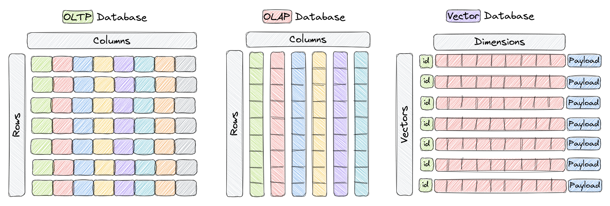
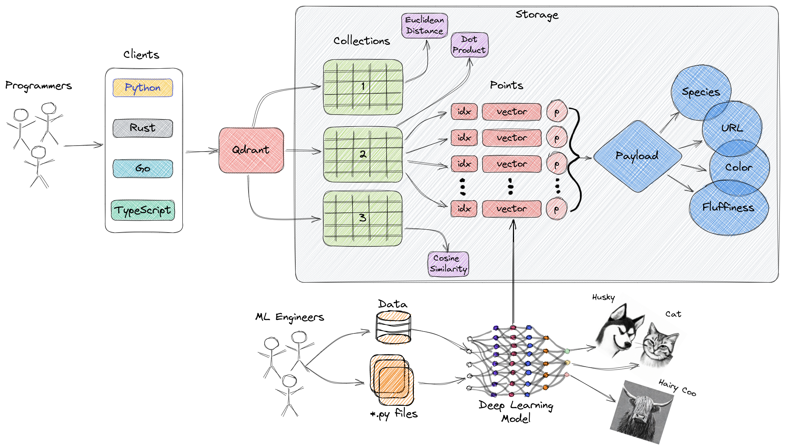

# Qdrant 101 - Introduction

Vector databases are a relatively new way for interacting with abstract data representations derived from opaque machine learning models such as deep learning architectures. These representations are often called vectors or embeddings and they are a compressed version of the data used to train a machine learning model to accomplish a task like sentiment analysis, speech recognition, object detection, and many others.

These new databases shine in many applications like [semantic search](https://en.wikipedia.org/wiki/Semantic_search) and [recommendation systems](https://en.wikipedia.org/wiki/Recommender_system), and here, we'll learn about one of the most popular and fastest growing vector databases in the market, [Qdrant](qdrant.tech).

## What is Qdrant?

[Qdrant](qdrant.tech) "is a vector similarity search engine that provides a production-ready service with a convenient API to store, search, and manage points (i.e. vectors) with an additional payload." You can think of the payloads as additional pieces of information that can help you hone in on your search and also receive useful information that you can give to your users.

You can get started using Qdrant with the Python `qdrant-client`, by pulling the latest docker image of `qdrant` and connecting to it locally, or by trying out [Qdrant's Cloud](https://cloud.qdrant.io/) free tier option until you are ready to make the full switch.

With that out of the way, let's talk about what are vector databases.

## What Are Vector Databases?

Vector databases are a type of database designed to store and query high-dimensional vectors efficiently. In traditional [OLTP](https://www.ibm.com/topics/oltp) and [OLAP](https://www.ibm.com/topics/olap) databases (as seen in the image above), data is organized in rows and columns (and these are called **Tables**), and queries are performed based on the values in those columns. However, in certain applications including image recognition, natural language processing, and recommendation systems, data is often represented as vectors in a high-dimensional space, and these vectors, plus an id and a payload, are the elements we store in something called a **Collection** a vector database like Qdrant.

A vector in this context is a mathematical representation of an object or data point, where each element of the vector corresponds to a specific feature or attribute of the object. For example, in an image recognition system, a vector could represent an image, with each element of the vector representing a pixel value or a descriptor/characteristic of that pixel. In a music recommendation system, each vector would represent a song, and each element of the vector would represent a characteristic song such as tempo, genre, lyrics, and so on.

Vector databases are optimized for **storing** and **querying** these high-dimensional vectors efficiently, and they often using specialized data structures and indexing techniques such as Hierarchical Navigable Small World (HNSW) -- which is used to implement Approximate Nearest Neighbors -- and Product Quantization, among others. These databases enable fast similarity and semantic search while allowing users to find vectors that are the closest to a given query vector based on some distance metric. The most commonly used distance metrics are Euclidean Distance, Cosine Similarity, and Dot Product, and these three are fully supported Qdrant.

Here's a quick overview of the three:
- [**Cosine Similarity**](https://en.wikipedia.org/wiki/Cosine_similarity) - Cosine similarity is a way to measure how similar two things are. Think of it like a ruler that tells you how far apart two points are, but instead of measuring distance, it measures how similar two things are. It's often used with text to compare how similar two documents or sentences are to each other. The output of the cosine similarity ranges from 0 to 1, where 0 means the two things are completely dissimilar, and 1 means the two things are exactly the same. It's a straightforward and effective way to compare two things!
- [**Dot Product**](https://en.wikipedia.org/wiki/Dot_product) - The dot product similarity metric is another way of measuring how similar two things are, like cosine similarity. It's often used in machine learning and data science when working with numbers. The dot product similarity is calculated by multiplying the values in two sets of numbers, and then adding up those products. The higher the sum, the more similar the two sets of numbers are. So, it's like a scale that tells you how closely two sets of numbers match each other.
- [**Euclidean Distance**](https://en.wikipedia.org/wiki/Euclidean_distance) - Euclidean distance is a way to measure the distance between two points in space, similar to how we measure the distance between two places on a map. It's calculated by finding the square root of the sum of the squared differences between the two points' coordinates. This distance metric is commonly used in machine learning to measure how similar or dissimilar two data points are or, in other words, to understand how far apart they are.

Now that we know what vector databases are and how they are structurally different than other databases, let's go over why they are important.

## Why do we need Vector Databases?

Vector databases play a crucial role in various applications that require similarity search, such as recommendation systems, content-based image retrieval, and personalized search. By taking advantage of their efficient indexing and searching techniques, vector databases enable faster and more accurate retrieval of unstructured data already represented as vectors, which can help put in front of users the most relevant results to their queries.

In addition, other benefits of using vector databases include:
1. Efficient storage and indexing of high-dimensional data.
3. Ability to handle large-scale datasets with billions of data points.
4. Support for real-time analytics and queries.
5. Ability to handle vectors derived from complex data types such as images, videos, and natural language text.
6. Improved performance and reduced latency in machine learning and AI applications.
7. Reduced development and deployment time and cost compared to building a custom solution.

Keep in mind that the specific benefits of using a vector database may vary depending on the use case of your organization and the features of the database you ultimately choose.

Let's now evaluate, at a high-level, the way Qdrant is architected.

## High-Level Overview of Qdrant's Architecture

The diagram above represents a high-level overview of some of the main components of Qdrant. Here are the terminologies you should get familiar with.

- [Collections](https://qdrant.tech/documentation/collections/): A collection is a named set of points (vectors with a payload) among which you can search. Vectors within the same collection can have different dimensionalities and be compared by a single metric.
- [Distance Metrics](https://en.wikipedia.org/wiki/Metric_space): These are used to measure similarities among vectors and they must be selected at the same time you are creating a collection. The choice of metric depends on the way the vectors were obtained and, in particular, on the neural network that will be used to encode new queries.
- [Points](https://qdrant.tech/documentation/points/): The points are the central entity that Qdrant operates with and they consist of a vector and an optional id and payload.
    - id: a unique identifier for your vectors.
    - Vector: a high-dimensional representation of data, for example, an image, a sound, a document, a video, etc.
    - [Payload](https://qdrant.tech/documentation/payload/): A payload is a JSON object with additional data you can add to a vector.
- [Storage](https://qdrant.tech/documentation/storage/): Qdrant can use one of two options for storage, **In-memory** storage (Stores all vectors in RAM, has the highest speed since disk access is required only for persistence), or **Memmap** storage, (creates a virtual address space associated with the file on disk).
- Clients: the programming languages you can use to connect to Qdrant.

## Next Steps

Now that you know more about vector databases and Qdrant, you are ready to get started with one of our tutorials. If you've never used a vector database, go ahead and jump straight into the **Getting Started** section. Conversely, if you are a seasoned developer in these technology, jump to the section most relevant to your use case.

As you go through the tutorials, please let us know if any questions come up in our [Discord channel here](https://qdrant.to/discord). 😎
