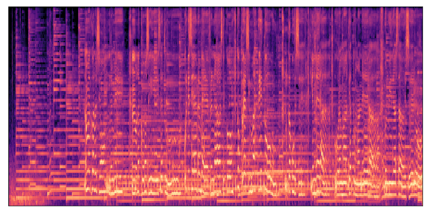

# Qdrant & Audio Data


Welcome to this tutorial on vector databases and music recommendation systems using Python and Qdrant. Here, 
we will learn about how to get started with audio data, embeddings and vector databases.

By the end of this tutorial, you will have a good understanding of how to use vector databases and Python 
to create your own music recommendation engine.

## 1. Overview

The dataset we will be using is called, 
[Ludwig Music Dataset (Moods and Subgenres)](https://www.kaggle.com/datasets/jorgeruizdev/ludwig-music-dataset-moods-and-subgenres) 
and it can be found on Kaggle. It was collected for the purpose of music information retrieval 
(MIR) by [Discogs](discogs.com) and [AcousticBrainZ](acousticbrainz.org), and it contains over 
10,000 songs of different genres and subgenres.

Once you download it, you should see the following directories and files.

```sh
../data/ludwig_music_data
├── labels.json
├── mfccs
│   ├── blues
│   ├── ...
│   └── rock
├── mp3
│   ├── blues
│   ├── ...
│   └── rock
├── spectogram
│   └── spectogram
└── subgeneres.json
```

The `labels.json` contain all the metadata (e.g. artist, subgenre, album, etc.) associated with each song.

The `Spectograms` directory contains spectograms, which are visual representation of the frequencies 
present in an audio signal over time. It is a 2D graph where the x-axis represents time and the y-axis 
represents frequency. The intensity of the color or brightness of the graph indicates the strength or 
amplitude of the frequencies at a particular time. Here is an example of a Spectogram.

<p align="center">
  
</p>

If you've ever wonder what audio could look like visually, this is one way to visualize it.

Let's get our environment set up before we prepare the data.

## 2. Set Up

Before you run any line of code, please make sure you have 
1. downloaded the data
2. created a virtual environment (if not in Google Colab)
3. installed the packages below
4. started a container with Qdrant

```bash
# with conda or mamba if you have it installed
mamba env create -n my_env python=3.10
mamba activate my_env

# or with virtualenv
python -m venv venv
source venv/bin/activate

# install packages
pip install qdrant-client transformers datasets pandas numpy torch librosa tensorflow openl3 panns-inference pedalboard
```

The open source version of Qdrant is available as a docker image and it can be pulled and run from 
any machine with docker installed. If you don't have Docker installed in your PC you can follow the 
instructions in the official documentation [here](https://docs.docker.com/get-docker/). After that, 
open your terminal start by downloading the image with the following command.

```sh
docker pull qdrant/qdrant
```

Next, initialize Qdrant with the following command, and you should be good to go.

```sh
docker run -p 6333:6333 \
    -v $(pwd)/qdrant_storage:/qdrant/storage \
    qdrant/qdrant
```

Verify that you are ready to go by importing the following libraries and connecting to Qdrant via its Python client.


```python
from transformers import AutoFeatureExtractor, AutoModel
from IPython.display import Audio as player
from datasets import load_dataset, Audio
from panns_inference import AudioTagging
from qdrant_client import QdrantClient
from qdrant_client.http import models
from glob import glob
import pandas as pd
import numpy as np
import librosa
import openl3
import torch
```


```python
client = QdrantClient(host="localhost", port=6333)
```


```python
my_collection = "music_collection"
client.recreate_collection(
    collection_name=my_collection,
    vectors_config=models.VectorParams(size=2048, distance=models.Distance.COSINE)
)
```


    True


## 3. Data Prep

We will be using Huggin Face's [datasets](https://huggingface.co/docs/datasets/index) library to read 
in our data and massage it a bit.


```python
data_path = "data/ludwig_music_data/mp3/latin/"
```

Feel free to change the genre to the one you like the best.


```python
music_data = load_dataset("audiofolder", data_dir=files, split="train", drop_labels=True)
music_data
```

    Dataset({
        features: ['audio'],
        num_rows: 979
    })


```python
music_data[115]
```

    {'audio': {'path': '/home/user/data/ludwig_music_data/mp3/latin/0rXvhxGisD2djBmNkrv5Gt.mp3',
      'array': array([ 0.00000000e+00,  1.24776700e-09, -4.54397187e-10, ...,
             -7.98814446e-02, -8.84955898e-02, -1.05223551e-01]),
      'sampling_rate': 44100}}


As you can see, we got back json objects with an array representing our songs, the path to where each 
one is located in our PC, and the sampling rate. Let's play the song at index 115.


```python
player(music_data[115]['audio']['array'], rate=44100)
```

<iframe style="border-radius:12px" src="https://open.spotify.com/embed/track/0rXvhxGisD2djBmNkrv5Gt?utm_source=generator" width="100%" height="152" frameBorder="0" allowfullscreen="" allow="autoplay; clipboard-write; encrypted-media; fullscreen; picture-in-picture" loading="lazy"></iframe>


We'll need to extract the name of each mp3 file as this is the unique identifier we'll use in order to 
get the corresponding metadata for each song. While we are at it, we will also create a range of numbers 
and add it as the index to the dataset.


```python
ids = [
    (
     music_data[i] # for every sample
     ['audio'] # in this directory
     ['path'] # extract the path
     .split("/") # split it by /
     [-1] # take only the last piece "id.mp3"
     .replace(".mp3", '') # and replace the .mp3 with nothing
    ) 
    for i in range(len(music_data))
]
index = [num for num in range(len(music_data))]
ids[:4]
```

    ['0010BnyFuw94XFautS2uJp',
     '00RhgYVH6DrHl0SuZWDp8W',
     '01k69xxIQGL94F8IfIkI5l',
     '02GUIyXZ9RNusgUocEQIzN']


```python
music_data = music_data.add_column("index", index)
music_data = music_data.add_column("ids", ids)
music_data[-1]
```

    {'audio': {'path': '/home/user/data/ludwig_music_data/mp3/latin/7yX4WgUfoPpMKZHgqpaZ0x.mp3',
      'array': array([ 0.00000000e+00, -1.40022882e-09, -4.44221415e-09, ...,
             -9.52053051e-02, -8.90597273e-02, -8.10846481e-02]),
      'sampling_rate': 44100},
     'index': 978,
     'ids': '7yX4WgUfoPpMKZHgqpaZ0x'}


The metadata we will use for our payload lives in the `labes.json` file, so let's extract it.


```python
label_path = "data/ludwig_music_data/labels.json"
labels = pd.read_json(label_path)
labels.head()
```


<div>
<style scoped>
    .dataframe tbody tr th:only-of-type {
        vertical-align: middle;
    }

    .dataframe tbody tr th {
        vertical-align: top;
    }

    .dataframe thead th {
        text-align: right;
    }
</style>
<table border="1" class="dataframe">
  <thead>
    <tr style="text-align: right;">
      <th></th>
      <th>tracks</th>
    </tr>
  </thead>
  <tbody>
    <tr>
      <th>000QWvZpHrBIVrW4dGbaVI</th>
      <td>{'otherSubgenres': {'L': [{'S': 'electronic---...</td>
    </tr>
    <tr>
      <th>0010BnyFuw94XFautS2uJp</th>
      <td>{'otherSubgenres': {'L': [{'S': ' world'}, {'S...</td>
    </tr>
    <tr>
      <th>0055LRFB7zfdCXDGodyIz3</th>
      <td>{'otherSubgenres': {'L': []}, 'artist': {'S': ...</td>
    </tr>
    <tr>
      <th>005Dlt8Xaz3DkaXiRJgdiS</th>
      <td>{'otherSubgenres': {'L': [{'S': 'rock'}, {'S':...</td>
    </tr>
    <tr>
      <th>006RpKEKItNO4q8TkAUpOv</th>
      <td>{'otherSubgenres': {'L': [{'S': 'classical---c...</td>
    </tr>
  </tbody>
</table>
</div>


As you can see, the dictionary above contains a lot of useful information. Let's create a function 
to extract the data we want retrieve fow our out system.


```python
def get_metadata(x):
    try:
        artist = list(x['artist'].values())[0]
        genre = list(x['genre'].values())[0]
        name = list(x['name'].values())[0]
        subgenres = list(x['subgenres'].values())[0]
    except:
        artist = "Unknown"
        genre = "Unknown"
        name = "Unknown"
        subgenres = "Unknown"
    return pd.Series(
        [artist, genre, name, subgenres], index=['artist', 'genre', 'name', 'subgenres']
    )
```


```python
clean_labels = labels['tracks'].apply(get_metadata).reset_index()
clean_labels.head()
```


<div>
<style scoped>
    .dataframe tbody tr th:only-of-type {
        vertical-align: middle;
    }

    .dataframe tbody tr th {
        vertical-align: top;
    }

    .dataframe thead th {
        text-align: right;
    }
</style>
<table border="1" class="dataframe">
  <thead>
    <tr style="text-align: right;">
      <th></th>
      <th>index</th>
      <th>artist</th>
      <th>genre</th>
      <th>name</th>
      <th>subgenres</th>
    </tr>
  </thead>
  <tbody>
    <tr>
      <th>0</th>
      <td>000QWvZpHrBIVrW4dGbaVI</td>
      <td>047</td>
      <td>electronic</td>
      <td>General Error</td>
      <td>[{'S': 'electronic---synth-pop'}]</td>
    </tr>
    <tr>
      <th>1</th>
      <td>0010BnyFuw94XFautS2uJp</td>
      <td>Jimmy Buffett</td>
      <td>latin</td>
      <td>La Vie Dansante</td>
      <td>[{'S': 'latin---cubano'}]</td>
    </tr>
    <tr>
      <th>2</th>
      <td>0055LRFB7zfdCXDGodyIz3</td>
      <td>New Order</td>
      <td>rock</td>
      <td>Doubts Even Here</td>
      <td>[{'S': 'rock---new wave'}]</td>
    </tr>
    <tr>
      <th>3</th>
      <td>005Dlt8Xaz3DkaXiRJgdiS</td>
      <td>Ricardo Arjona</td>
      <td>rock</td>
      <td>Historia de Taxi</td>
      <td>[{'S': 'rock---pop rock'}]</td>
    </tr>
    <tr>
      <th>4</th>
      <td>006RpKEKItNO4q8TkAUpOv</td>
      <td>Worrytrain</td>
      <td>electronic</td>
      <td>They Will Make My Passage Easy</td>
      <td>[{'S': 'electronic---ambient'}]</td>
    </tr>
  </tbody>
</table>
</div>


The last piece of the puzzle is to clean the subgenres a bit and to extract the path to each of the 
files since we will need them to load the recommendation in our app later on.


```python
def get_vals(genres):
    genre_list = []
    for dicts in genres:
        if type(dicts) != str:
            for _, val in dicts.items():
                genre_list.append(val)
    return genre_list

clean_labels['subgenres'] = clean_labels.subgenres.apply(get_vals)
clean_labels['subgenres'].head()
```


```python
file_path = "data/ludwig_music_data/mp3/latin/*.mp3"
files = glob(file_path)
ids = [i.split('/')[-1].replace(".mp3", '') for i in files]
music_paths = pd.DataFrame(zip(ids, files), columns=["ids", 'urls'])
music_paths.head()
```

We'll combine both files into a metadata dataframe and then extract a list of JSON objects for our payload.


```python
metadata = (music_data.select_columns(['index', 'ids'])
                     .to_pandas()
                     .merge(right=clean_labels, how="left", left_on='ids', right_on='index')
                     .merge(right=music_paths, how="left", left_on='ids', right_on='ids')
                     .drop("index_y", axis=1)
                     .rename({"index_x": "index"}, axis=1)
        )
metadata.head()
```


<div>
<style scoped>
    .dataframe tbody tr th:only-of-type {
        vertical-align: middle;
    }

    .dataframe tbody tr th {
        vertical-align: top;
    }

    .dataframe thead th {
        text-align: right;
    }
</style>
<table border="1" class="dataframe">
  <thead>
    <tr style="text-align: right;">
      <th></th>
      <th>index</th>
      <th>ids</th>
      <th>artist</th>
      <th>genre</th>
      <th>name</th>
      <th>subgenres</th>
      <th>urls</th>
    </tr>
  </thead>
  <tbody>
    <tr>
      <th>0</th>
      <td>0</td>
      <td>0010BnyFuw94XFautS2uJp</td>
      <td>Jimmy Buffett</td>
      <td>latin</td>
      <td>La Vie Dansante</td>
      <td>[latin---cubano]</td>
      <td>data/ludwig_mus...</td>
    </tr>
    <tr>
      <th>1</th>
      <td>1</td>
      <td>00RhgYVH6DrHl0SuZWDp8W</td>
      <td>Jimmy Buffett</td>
      <td>latin</td>
      <td>Brown Eyed Girl</td>
      <td>[latin---cubano]</td>
      <td>data/ludwig_mus...</td>
    </tr>
    <tr>
      <th>2</th>
      <td>2</td>
      <td>01k69xxIQGL94F8IfIkI5l</td>
      <td>Los Delinqüentes</td>
      <td>latin</td>
      <td>Fumata Del Ladrillo</td>
      <td>[latin---flamenco, rock---punk]</td>
      <td>data/ludwig_mus...</td>
    </tr>
    <tr>
      <th>3</th>
      <td>3</td>
      <td>02GUIyXZ9RNusgUocEQIzN</td>
      <td>La Bottine Souriante</td>
      <td>latin</td>
      <td>Ma Paillasse</td>
      <td>[latin---salsa]</td>
      <td>data/ludwig_mus...</td>
    </tr>
    <tr>
      <th>4</th>
      <td>4</td>
      <td>02IFfsWwxek6h9qLEH4sRA</td>
      <td>Gipsy Kings</td>
      <td>latin</td>
      <td>Estrellas</td>
      <td>[latin---flamenco]</td>
      <td>data/ludwig_mus...</td>
    </tr>
  </tbody>
</table>
</div>


```python
payload = metadata.drop(['index', 'ids'], axis=1).to_dict(orient="records")
payload[:3]
```

    [{'artist': 'Jimmy Buffett',
      'genre': 'latin',
      'name': 'La Vie Dansante',
      'subgenres': ['latin---cubano'],
      'urls': 'data/ludwig_music_data/mp3/latin/0010BnyFuw94XFautS2uJp.mp3'},
     {'artist': 'Jimmy Buffett',
      'genre': 'latin',
      'name': 'Brown Eyed Girl',
      'subgenres': ['latin---cubano'],
      'urls': 'data/ludwig_music_data/mp3/latin/00RhgYVH6DrHl0SuZWDp8W.mp3'},
     {'artist': 'Los Delinqüentes',
      'genre': 'latin',
      'name': 'Fumata Del Ladrillo',
      'subgenres': ['latin---flamenco', 'rock---punk'],
      'urls': 'data/ludwig_music_data/mp3/latin/01k69xxIQGL94F8IfIkI5l.mp3'}]


## 4. Embeddings

Audio embeddings are low dimensional vector representations of audio signals and they capture 
important features such as the pitch, timbre, and spatial characteristics of the sound. These 
embeddings can be used as compact and meaningful representations of audio signals for various 
downstream audio processing tasks such as speech recognition, speaker recognition, music genre 
classification, and event detection. These embeddings are generally obtained using deep neural 
network models that take an audio signal as input, and output a learned low-dimensional feature 
representation for that audio. In addition, these embeddings can also be used as input to further 
machine learning models.

There are different ways in which we can get started creating embeddings from our songs: (1) by 
training a deep neural network from scratch on our dataset and extracting the embedding layer, (2) 
by using a pre-trained model and the transformers library, or (3) by using purpose-built libraries 
like openl3 and pann_inference. There are other ways, of course, but here we'll use latter two options, 
transformers, openl3 and pann_inference. Let's get started.

### openl3

[OpenL3](https://github.com/marl/openl3/tree/main) is an open-source Python library for computing 
deep audio and image embeddings. It was created to provide an easy-to-use framework for extracting 
embeddings from audio and image data using pre-trained deep neural network models. The library 
includes pre-trained audio models like VGGish, YAMNet, and SoundNet, as well as pre-trained image 
models like ResNet and Inception. These models can be used for a variety of audio and image processing 
tasks, such as speech recognition, music genre classification, and object detection. Overall, OpenL3 
is designed to make it easier for researchers and developers to incorporate deep learning models into 
their audio and image processing workflows.

Let's read in an audio file and extract the embedding layer with openl3.


```python
one_song = '/home/user/data/ludwig_music_data/mp3/latin/0rXvhxGisD2djBmNkrv5Gt.mp3'
audio, sr = librosa.core.load(one_song, sr=44100, mono=True)
audio.shape
```

    (1322496,)


```
player(audio, rate=sr)
```

<iframe style="border-radius:12px" src="https://open.spotify.com/embed/track/0rXvhxGisD2djBmNkrv5Gt?utm_source=generator" width="100%" height="152" frameBorder="0" allowfullscreen="" allow="autoplay; clipboard-write; encrypted-media; fullscreen; picture-in-picture" loading="lazy"></iframe>


```python
open_emb, ts = openl3.get_audio_embedding(audio, sr, input_repr="mel128", frontend='librosa')
```

    2023-06-01 10:57:00.894785: I tensorflow/core/platform/cpu_feature_guard.cc:182] This TensorFlow binary is optimized to use available CPU instructions in performance-critical operations.
    To enable the following instructions: AVX2 FMA, in other operations, rebuild TensorFlow with the appropriate compiler flags.
    2023-06-01 10:57:02.592527: W tensorflow/compiler/tf2tensorrt/utils/py_utils.cc:38] TF-TRT Warning: Could not find TensorRT
    2023-06-01 10:57:03.840521: I tensorflow/compiler/xla/stream_executor/cuda/cuda_gpu_executor.cc:996] successful NUMA node read from SysFS had negative value (-1), but there must be at least one NUMA node, so returning NUMA node zero. See more at https://github.com/torvalds/linux/blob/v6.0/Documentation/ABI/testing/sysfs-bus-pci#L344-L355
    2023-06-01 10:57:03.897027: W tensorflow/core/common_runtime/gpu/gpu_device.cc:1956] Cannot dlopen some GPU libraries. Please make sure the missing libraries mentioned above are installed properly if you would like to use GPU. Follow the guide at https://www.tensorflow.org/install/gpu for how to download and setup the required libraries for your platform.
    Skipping registering GPU devices...


    10/10 [==============================] - 14s 1s/step


The model returns an embedding vector for each timestamp and a timestamp vector. This means that 
to get a one dimensional embedding for the whole song, we'll need to get the mean of this vectors.


```python
open_emb.shape, open_emb.mean(axis=0).shape, open_emb.mean(axis=0)[:20]
```

    ((296, 6144),
     (6144,),
     array([ 2.049003  , -0.36621153,  1.8096788 ,  1.2619342 ,  1.8309749 ,
             1.9074773 ,  0.6995117 ,  0.39577007,  2.1118143 ,  2.223477  ,
             0.5839968 ,  1.0553869 ,  2.8493981 ,  1.0844557 ,  1.5389911 ,
             1.5453324 ,  1.8822186 ,  2.1338508 ,  2.4251754 , -0.16668636],
           dtype=float32))


You can generate your embedding layer for the whole dataset with the following function. Note that 
loading the model first, in particular Kapre, will work on a GPU without any further configuration.


```python
model_kapre = openl3.models.load_audio_embedding_model(
    input_repr='mel128', content_type='music', embedding_size=512
)

def get_open_embs(batch):
    audio_arrays = [song['array'] for song in batch['audio']]
    sr_arrays = [song['sampling_rate'] for song in batch['audio']]
    embs_list, _ = openl3.get_audio_embedding(audio_arrays, sr_arrays, model=model_kapre)
    batch["open_embeddings"] = np.array([embedding.mean(axis=0) for embedding in embs_list])
    return batch
```


```
music_data = music_data.map(get_open_embs, batched=True, batch_size=20)
music_data
```

The nice thing about openl3 is that it comes with the best model for our task. The downside is that 
it is the slowest of the three methods showcased here.

### Panns Inference

The `panns_inference` library is a Python package built on top of PyTorch and torchaudio that provides 
an interface for audio tagging and sound event detection tasks. It implements CNN-based models trained 
on large-scale audio datasets such as AudioSet and UrbanSound8K. The package was created to make it 
easy for researchers and practitioners to use these pre-trained models for inference on their own 
audio datasets, without needing to train their own models from scratch. The `panns_inference` library 
provides a high-level, user-friendly API for loading pre-trained models, generating embeddings, and 
performing audio classification tasks in just a few lines of code.

The `panns_inference` package requires that the data is either as a numpy array or as a torch tensor, 
both of shape `[batch, vector]` so let's reshape our song.


```python
audio2 = audio[None, :]
audio2.shape
```

    (1, 1322496)


Bare in mind that this next step, downloading the model, can take quite a bit of time depending on your 
internet speed. Afterwards, inference is quite fast and the model will return to us to vectors, the 
timestamps output and the embedding in the same shape as the input vector.


```python
at = AudioTagging(checkpoint_path=None, device='cuda')
```

    Checkpoint path: /home/user/panns_data/Cnn14_mAP=0.431.pth
    GPU number: 1


```python
clipwise_output, embedding = at.inference(audio2)
```


```python
clipwise_output.shape, embedding.shape
```

    ((1, 527), (1, 2048))


```python
embedding[0, 470:500]
```

    array([0.       , 0.       , 0.       , 0.       , 0.       , 0.       ,
           3.1233616, 0.       , 0.       , 0.       , 0.       , 0.       ,
           0.       , 0.       , 0.       , 0.       , 0.       , 0.       ,
           0.       , 1.6375436, 0.       , 0.       , 0.       , 0.       ,
           0.       , 0.       , 0.       , 0.       , 0.       , 0.       ],
          dtype=float32)


To get an embedding layer for all of the songs using the `panns_inference` package, you can use the 
following function. This is the output we will be using for the remainder of the tutorial.


```python
def get_panns_embs(batch):
    arrays = [torch.tensor(val['array'], dtype=torch.float64) for val in batch['audio']]
    inputs = torch.nn.utils.rnn.pad_sequence(arrays, batch_first=True, padding_value=0).type(torch.cuda.FloatTensor)
    _, embedding = at.inference(inputs)
    batch['panns_embeddings'] = embedding
    return batch
```


```
music_data = music_data.map(get_panns_embs, batched=True, batch_size=8)
music_data
```

    Dataset({
        features: ['audio', 'index', 'ids', 'panns_embeddings'],
        num_rows: 979
    })


### Transformers

Transformers are a type of neural network used for natural language processing, but they can also be 
used for processing audio data by breaking the sound waves into smaller parts and learning how those 
parts fit together to form meaning.

We can load a pre-trained model from the Hugging Face hub and extract the embeddings from it. Note 
that this step will give us the worst result of the three since Wav2Vec was trained for speech 
recognition rather than music genre classification. Hence, it is important to note that fine-tunning 
the data with Wav2Vec might not improve a whole lot the quality of the embeddings.


```python
device = torch.device("cuda" if torch.cuda.is_available() else "cpu")
model = AutoModel.from_pretrained('facebook/wav2vec2-base').to(device)
feature_extractor = AutoFeatureExtractor.from_pretrained('facebook/wav2vec2-base')
```

    /home/user/anaconda/envs/qdrant101/lib/python3.10/site-packages/transformers/configuration_utils.py:380: UserWarning: Passing `gradient_checkpointing` to a config initialization is deprecated and will be removed in v5 Transformers. Using `model.gradient_checkpointing_enable()` instead, or if you are using the `Trainer` API, pass `gradient_checkpointing=True` in your `TrainingArguments`.
      warnings.warn(
    Some weights of the model checkpoint at facebook/wav2vec2-base were not used when initializing Wav2Vec2Model: ['project_hid.weight', 'quantizer.weight_proj.bias', 'quantizer.codevectors', 'project_q.weight', 'project_q.bias', 'project_hid.bias', 'quantizer.weight_proj.weight']
    - This IS expected if you are initializing Wav2Vec2Model from the checkpoint of a model trained on another task or with another architecture (e.g. initializing a BertForSequenceClassification model from a BertForPreTraining model).
    - This IS NOT expected if you are initializing Wav2Vec2Model from the checkpoint of a model that you expect to be exactly identical (initializing a BertForSequenceClassification model from a BertForSequenceClassification model).


A key step before extracting the features from each song and passing them through the model is to resample the songs 16kHz.


```python
resampled_audio = librosa.resample(y=audio2, orig_sr=sr, target_sr=16_000)
display(player(resampled_audio, rate=16_000))
resampled_audio.shape
```
<iframe style="border-radius:12px" src="https://open.spotify.com/embed/track/0rXvhxGisD2djBmNkrv5Gt?utm_source=generator" width="100%" height="152" frameBorder="0" allowfullscreen="" allow="autoplay; clipboard-write; encrypted-media; fullscreen; picture-in-picture" loading="lazy"></iframe>

    (1, 479818)


```python
inputs = feature_extractor(
    resampled_audio[0], sampling_rate=feature_extractor.sampling_rate, return_tensors="pt",
    padding=True, return_attention_mask=True, truncation=True, max_length=16_000
).to(device)

inputs['input_values'].shape
```

    torch.Size([1, 479818])


```python
with torch.no_grad():
    embeddings = model(**inputs).last_hidden_state.mean(dim=1)
embeddings.shape
```

    torch.Size([1, 768])


To generate the embedding layer for the whole dataset, we can use the following function.


```python
def get_trans_embs(batch):
    audio_arrays = [x["array"] for x in batch["audio"]]

    inputs = feature_extractor(
        audio_arrays, sampling_rate=16_000, return_tensors="pt", padding=True, 
        return_attention_mask=True, max_length=16_000, truncation=True
    ).to(device)

    with torch.no_grad():
        pooled_embeds = model(**inputs).last_hidden_state.mean(dim=1)
    
    return {"transform_embeddings": pooled_embeds.cpu().numpy()}
```


```
music_data = music_data.cast_column("audio", Audio(sampling_rate=16_000))
music_data = music_data.map(embed_audio, batched=True, batch_size=20)
music_data
```

## 5. Building a Recommendation System

Recommendation systems are algorithms and techniques used to suggest items or content to users based 
on their preferences, historical data, or behavior. These systems aim to provide personalized 
recommendations to users, helping them discover new items of interest and enhancing their overall 
user experience. Recommendation systems are widely used in various domains such as e-commerce, 
streaming platforms, social media, and more.

Let's start by populating the collection we created earlier. If you picked the transformers approach 
or openl3, don't forget to to recreate your collection with the appropriate dimension size.


```python
client.upsert(
    collection_name=my_collection,
    points=models.Batch(
        ids=music_data['index'],
        vectors=music_data['panns_embeddings'],
        payloads=payload
    )
)
```

    UpdateResult(operation_id=0, status=<UpdateStatus.COMPLETED: 'completed'>)


We can retrieve any song by its id using `client.retrieve()` and then extract the information in the 
payload with the `.payload` attribute.


```python
result = client.retrieve(
    collection_name=my_collection,
    ids=[100],
    with_vectors=True # we can turn this on and off depending on our needs
)
```


```
result[0].payload
```

    {'artist': 'La Bottine Souriante',
     'genre': 'latin',
     'name': 'Chant de la luette',
     'subgenres': ['latin---salsa'],
     'urls': '../../../challenges/qdrant_chl/data/ludwig_music_data/mp3/latin/0lyeChzw7IWf9ytZ7S0jDK.mp3'}


```python
r = librosa.core.load(result[0].payload['urls'], sr=44100, mono=True)
player(r[0], rate=r[1])
```


<iframe style="border-radius:12px" src="https://open.spotify.com/embed/track/0lyeChzw7IWf9ytZ7S0jDK?utm_source=generator" width="100%" height="152" frameBorder="0" allowfullscreen="" allow="autoplay; clipboard-write; encrypted-media; fullscreen; picture-in-picture" loading="lazy"></iframe>


You can search for similar songs with the `client.search()` method. Let's find and artist and a song we like 
and use that id to grab the embedding and search for similar songs.

PS. Here is [Celia Cruz](https://www.youtube.com/watch?v=AXN-_asIaYs&ab_channel=GravityLimited). 😎


```python
metadata.query("artist == 'Celia Cruz'")
```


<div>
<style scoped>
    .dataframe tbody tr th:only-of-type {
        vertical-align: middle;
    }

    .dataframe tbody tr th {
        vertical-align: top;
    }

    .dataframe thead th {
        text-align: right;
    }
</style>
<table border="1" class="dataframe">
  <thead>
    <tr style="text-align: right;">
      <th></th>
      <th>index</th>
      <th>ids</th>
      <th>artist</th>
      <th>genre</th>
      <th>name</th>
      <th>subgenres</th>
      <th>urls</th>
    </tr>
  </thead>
  <tbody>
    <tr>
      <th>122</th>
      <td>122</td>
      <td>0v1oaOqkXpubdykx58BQwY</td>
      <td>Celia Cruz</td>
      <td>latin</td>
      <td>Juancito Trucupey</td>
      <td>[latin---salsa]</td>
      <td>data/ludwig_mus...</td>
    </tr>
    <tr>
      <th>150</th>
      <td>150</td>
      <td>19zWrDlXew0Fzouu7a4qhx</td>
      <td>Celia Cruz</td>
      <td>latin</td>
      <td>Cuando Sali De Cuba</td>
      <td>[latin---salsa]</td>
      <td>data/ludwig_mus...</td>
    </tr>
    <tr>
      <th>178</th>
      <td>178</td>
      <td>1MYds6o9aN2Wxa4TDxcJPB</td>
      <td>Celia Cruz</td>
      <td>latin</td>
      <td>Mi vida es cantar</td>
      <td>[latin---salsa]</td>
      <td>data/ludwig_mus...</td>
    </tr>
    <tr>
      <th>459</th>
      <td>459</td>
      <td>3WphzI2fb2NTUsfja51U7P</td>
      <td>Celia Cruz</td>
      <td>latin</td>
      <td>Dile que por mi no tema</td>
      <td>[latin---salsa]</td>
      <td>data/ludwig_mus...</td>
    </tr>
  </tbody>
</table>
</div>


```python
client.search(
    collection_name=my_collection,
    query_vector=music_data[150]['panns_embeddings'],
    limit=10
)
```

    [ScoredPoint(id=150, version=0, score=0.99999994, payload={'artist': 'Celia Cruz', 'genre': 'latin', 'name': 'Cuando Sali De Cuba', 'subgenres': ['latin---salsa'], 'urls': '../../../challenges/qdrant_chl/data/ludwig_music_data/mp3/latin/19zWrDlXew0Fzouu7a4qhx.mp3'}, vector=None),
     ScoredPoint(id=730, version=0, score=0.9206133, payload={'artist': 'Cartola', 'genre': 'latin', 'name': 'Fita meus olhos', 'subgenres': ['latin---samba'], 'urls': '../../../challenges/qdrant_chl/data/ludwig_music_data/mp3/latin/5iyRJ796USPTXEO4JXO0gC.mp3'}, vector=None),
     ScoredPoint(id=251, version=0, score=0.9087784, payload={'artist': "Oscar D'León", 'genre': 'latin', 'name': 'Volver a Verte', 'subgenres': ['latin---salsa'], 'urls': '../../../challenges/qdrant_chl/data/ludwig_music_data/mp3/latin/1kD5EOoZ45kjq50NLfhRGc.mp3'}, vector=None),
     ScoredPoint(id=739, version=0, score=0.90295744, payload={'artist': 'Cartola', 'genre': 'latin', 'name': 'Verde que te quero rosa', 'subgenres': ['latin---samba'], 'urls': '../../../challenges/qdrant_chl/data/ludwig_music_data/mp3/latin/5plwAx4oAWnuhSwivS5Yeg.mp3'}, vector=None),
     ScoredPoint(id=268, version=0, score=0.8995003, payload={'artist': 'Chicha Libre', 'genre': 'latin', 'name': 'La cumbia del zapatero', 'subgenres': ['latin---salsa'], 'urls': '../../../challenges/qdrant_chl/data/ludwig_music_data/mp3/latin/1ufmU58QldvKrHuATBb3kU.mp3'}, vector=None),
     ScoredPoint(id=766, version=0, score=0.88916755, payload={'artist': 'Ska Cubano', 'genre': 'latin', 'name': 'Tequila', 'subgenres': ['latin---cubano', 'reggae'], 'urls': '../../../challenges/qdrant_chl/data/ludwig_music_data/mp3/latin/618iBzv4oH2wb0WElQV9ru.mp3'}, vector=None),
     ScoredPoint(id=7, version=0, score=0.8882055, payload={'artist': 'Ibrahim Ferrer', 'genre': 'latin', 'name': 'Nuestra Ruca', 'subgenres': ['latin---cubano'], 'urls': '../../../challenges/qdrant_chl/data/ludwig_music_data/mp3/latin/02vPUwCweGxigItnNf2Jfr.mp3'}, vector=None),
     ScoredPoint(id=467, version=0, score=0.88348734, payload={'artist': 'La-33', 'genre': 'latin', 'name': 'Soledad', 'subgenres': ['latin---salsa'], 'urls': '../../../challenges/qdrant_chl/data/ludwig_music_data/mp3/latin/3bpqoOSDwdaK003DPMvDJQ.mp3'}, vector=None),
     ScoredPoint(id=388, version=0, score=0.882995, payload={'artist': 'David Byrne', 'genre': 'latin', 'name': 'Loco De Amor', 'subgenres': ['latin---salsa', 'latin---samba', 'rock---pop rock'], 'urls': '../../../challenges/qdrant_chl/data/ludwig_music_data/mp3/latin/2uJsn2yi8HVZ8qwICHcNSW.mp3'}, vector=None),
     ScoredPoint(id=139, version=0, score=0.8820398, payload={'artist': 'Ibrahim Ferrer', 'genre': 'latin', 'name': 'Qué bueno baila usted', 'subgenres': ['latin---cubano'], 'urls': '../../../challenges/qdrant_chl/data/ludwig_music_data/mp3/latin/16FEEqvnZKcgfA5esxe5kL.mp3'}, vector=None)]


You can evaluate the search results by looking at the score or by listening to the songs and judging how 
similar they really are. I, the author, can vouch for the quality of the ones we got for Celia Cruz.

The recommendation API works a bit differently, we don't need a vector query but rather the ids of positive 
(required) vectors and negative (optional) ones, and Qdrant will do the heavy lifting for us.


```python
client.recommend(
    collection_name=my_collection,
    positive=[178, 122],
    limit=5
)
```

    [ScoredPoint(id=384, version=0, score=0.96683824, payload={'artist': 'Gilberto Santa Rosa', 'genre': 'latin', 'name': 'Perdoname', 'subgenres': ['latin---salsa'], 'urls': '../../../challenges/qdrant_chl/data/ludwig_music_data/mp3/latin/2qqrgPaRZow7lrLttDL6Im.mp3'}, vector=None),
     ScoredPoint(id=424, version=0, score=0.9633477, payload={'artist': 'Gilberto Santa Rosa', 'genre': 'latin', 'name': 'Amanecer Borincano', 'subgenres': ['latin---salsa'], 'urls': '../../../challenges/qdrant_chl/data/ludwig_music_data/mp3/latin/39FQfusOwKnPCjOgQHcx6S.mp3'}, vector=None),
     ScoredPoint(id=190, version=0, score=0.9624174, payload={'artist': 'Luigi Texidor', 'genre': 'latin', 'name': 'Mi Testamento', 'subgenres': ['latin---salsa'], 'urls': '../../../challenges/qdrant_chl/data/ludwig_music_data/mp3/latin/1RIdI5c7RjjagAcMA5ixpv.mp3'}, vector=None),
     ScoredPoint(id=92, version=0, score=0.95979774, payload={'artist': 'Tito Puente', 'genre': 'latin', 'name': 'Mambo Gozón', 'subgenres': ['latin---samba'], 'urls': '../../../challenges/qdrant_chl/data/ludwig_music_data/mp3/latin/0hk1gSyn3wKgdxqF6qaKUZ.mp3'}, vector=None),
     ScoredPoint(id=886, version=0, score=0.95851713, payload={'artist': 'Tony Vega', 'genre': 'latin', 'name': 'Ella es', 'subgenres': ['latin---salsa'], 'urls': '../../../challenges/qdrant_chl/data/ludwig_music_data/mp3/latin/718X6sjlHdmOzdTfJv4tUc.mp3'}, vector=None)]


Say we don't like [Chayanne](https://www.youtube.com/watch?v=GQa10n21YIw&ab_channel=AnnunziattaGibson) 
because his songs are too mushy. We can use the id of one of his mushiest songs so that Qdrant gets us 
results as far away as possible from such song.


```python
metadata.query("artist == 'Chayanne'")
```


<div>
<style scoped>
    .dataframe tbody tr th:only-of-type {
        vertical-align: middle;
    }

    .dataframe tbody tr th {
        vertical-align: top;
    }

    .dataframe thead th {
        text-align: right;
    }
</style>
<table border="1" class="dataframe">
  <thead>
    <tr style="text-align: right;">
      <th></th>
      <th>index</th>
      <th>ids</th>
      <th>artist</th>
      <th>genre</th>
      <th>name</th>
      <th>subgenres</th>
      <th>urls</th>
    </tr>
  </thead>
  <tbody>
    <tr>
      <th>162</th>
      <td>162</td>
      <td>1EyREvPFfh2TgXFMCPoydD</td>
      <td>Chayanne</td>
      <td>latin</td>
      <td>Caprichosa</td>
      <td>[latin---salsa, pop---ballad]</td>
      <td>data/ludwig_mus...</td>
    </tr>
    <tr>
      <th>208</th>
      <td>208</td>
      <td>1XMw83NJw29iwarOqVibos</td>
      <td>Chayanne</td>
      <td>latin</td>
      <td>Querida</td>
      <td>[latin---samba, pop---ballad]</td>
      <td>data/ludwig_mus...</td>
    </tr>
    <tr>
      <th>385</th>
      <td>385</td>
      <td>2sKo5u6IppUEudIz265wYa</td>
      <td>Chayanne</td>
      <td>latin</td>
      <td>Yo Te Amo</td>
      <td>[latin---salsa, pop---ballad]</td>
      <td>data/ludwig_mus...</td>
    </tr>
    <tr>
      <th>412</th>
      <td>412</td>
      <td>34hM4PLlhyBysgL50IWdHf</td>
      <td>Chayanne</td>
      <td>latin</td>
      <td>Y tú te vas</td>
      <td>[latin---salsa, pop---ballad]</td>
      <td>data/ludwig_mus...</td>
    </tr>
    <tr>
      <th>645</th>
      <td>645</td>
      <td>4zkOTmiamebLJ39Sqbp7sb</td>
      <td>Chayanne</td>
      <td>latin</td>
      <td>Boom Boom</td>
      <td>[latin---salsa, pop---ballad]</td>
      <td>data/ludwig_mus...</td>
    </tr>
  </tbody>
</table>
</div>


```python
client.recommend(
    collection_name=my_collection,
    positive=[178, 122],
    negative=[385],
    limit=5
)
```

    [ScoredPoint(id=546, version=0, score=0.87100524, payload={'artist': '¡Cubanismo!', 'genre': 'latin', 'name': 'El Preguntón', 'subgenres': ['latin---salsa'], 'urls': '../../../challenges/qdrant_chl/data/ludwig_music_data/mp3/latin/4EH5vM8p1Ibvlz5cgZLHvY.mp3'}, vector=None),
     ScoredPoint(id=85, version=0, score=0.86223793, payload={'artist': '¡Cubanismo!', 'genre': 'latin', 'name': 'Malembe', 'subgenres': ['latin---salsa'], 'urls': '../../../challenges/qdrant_chl/data/ludwig_music_data/mp3/latin/0efiEWiAFtHrQHTWfeDikg.mp3'}, vector=None),
     ScoredPoint(id=910, version=0, score=0.8605486, payload={'artist': '¡Cubanismo!', 'genre': 'latin', 'name': 'Cubanismo Llegó', 'subgenres': ['latin---salsa'], 'urls': '../../../challenges/qdrant_chl/data/ludwig_music_data/mp3/latin/7FSSdHxCoyEMfHUP6NdOb2.mp3'}, vector=None),
     ScoredPoint(id=540, version=0, score=0.85953826, payload={'artist': 'Tito Puente', 'genre': 'latin', 'name': 'Cual Es La Idea', 'subgenres': ['latin---samba'], 'urls': '../../../challenges/qdrant_chl/data/ludwig_music_data/mp3/latin/4CNCGwxNp9rnVqo2fzmDYK.mp3'}, vector=None),
     ScoredPoint(id=812, version=0, score=0.85860175, payload={'artist': 'Tommy Olivencia', 'genre': 'latin', 'name': 'Trucutú', 'subgenres': ['latin---salsa'], 'urls': '../../../challenges/qdrant_chl/data/ludwig_music_data/mp3/latin/6I9OiSVppRGjuAweyBucE2.mp3'}, vector=None)]


Say we want a song we just recently listened to and the system remembers all of our preferences.


```
marc_anthony_valio_la_pena = music_data[301]
```


```python
client.recommend(
    collection_name=my_collection,
    query_vector=marc_anthony_valio_la_pena['panns_embeddings'],
    positive=[178, 122, 459],
    negative=[385],
    limit=5
)
```

    [ScoredPoint(id=546, version=0, score=0.86705625, payload={'artist': '¡Cubanismo!', 'genre': 'latin', 'name': 'El Preguntón', 'subgenres': ['latin---salsa'], 'urls': '../../../challenges/qdrant_chl/data/ludwig_music_data/mp3/latin/4EH5vM8p1Ibvlz5cgZLHvY.mp3'}, vector=None),
     ScoredPoint(id=85, version=0, score=0.8635909, payload={'artist': '¡Cubanismo!', 'genre': 'latin', 'name': 'Malembe', 'subgenres': ['latin---salsa'], 'urls': '../../../challenges/qdrant_chl/data/ludwig_music_data/mp3/latin/0efiEWiAFtHrQHTWfeDikg.mp3'}, vector=None),
     ScoredPoint(id=540, version=0, score=0.8588973, payload={'artist': 'Tito Puente', 'genre': 'latin', 'name': 'Cual Es La Idea', 'subgenres': ['latin---samba'], 'urls': '../../../challenges/qdrant_chl/data/ludwig_music_data/mp3/latin/4CNCGwxNp9rnVqo2fzmDYK.mp3'}, vector=None),
     ScoredPoint(id=812, version=0, score=0.85626286, payload={'artist': 'Tommy Olivencia', 'genre': 'latin', 'name': 'Trucutú', 'subgenres': ['latin---salsa'], 'urls': '../../../challenges/qdrant_chl/data/ludwig_music_data/mp3/latin/6I9OiSVppRGjuAweyBucE2.mp3'}, vector=None),
     ScoredPoint(id=587, version=0, score=0.85231805, payload={'artist': 'Tito Puente & His Orchestra', 'genre': 'latin', 'name': 'Mambo Gozon', 'subgenres': ['latin---salsa'], 'urls': '../../../challenges/qdrant_chl/data/ludwig_music_data/mp3/latin/4Sewxyw6EtUldCIz2sD9S5.mp3'}, vector=None)]


Lastly, imagine we want a [Samba](https://www.youtube.com/watch?v=m3WtyqJzLAI&ab_channel=luka%C4%8Denko7) filter for the recommendations we get, the UI could have tags for us to choose from and Qdrant would do the rest for us.


```python
samba_songs = models.Filter(
    must=[models.FieldCondition(key="subgenres", match=models.MatchAny(any=['latin---samba']))]
)
```


```
results = client.recommend(
    collection_name=my_collection,
    query_vector=marc_anthony_valio_la_pena['panns_embeddings'],
    query_filter=samba_songs,
    positive=[178, 122, 459],
    negative=[385],
    limit=5
)
results
```

    [ScoredPoint(id=540, version=0, score=0.8588973, payload={'artist': 'Tito Puente', 'genre': 'latin', 'name': 'Cual Es La Idea', 'subgenres': ['latin---samba'], 'urls': '../../../challenges/qdrant_chl/data/ludwig_music_data/mp3/latin/4CNCGwxNp9rnVqo2fzmDYK.mp3'}, vector=None),
     ScoredPoint(id=493, version=0, score=0.8236424, payload={'artist': 'Tito Nieves', 'genre': 'latin', 'name': 'De mi enamórate', 'subgenres': ['latin---samba'], 'urls': '../../../challenges/qdrant_chl/data/ludwig_music_data/mp3/latin/3nnQUYKWBmHlfm5XpdWqNr.mp3'}, vector=None),
     ScoredPoint(id=92, version=0, score=0.8120091, payload={'artist': 'Tito Puente', 'genre': 'latin', 'name': 'Mambo Gozón', 'subgenres': ['latin---samba'], 'urls': '../../../challenges/qdrant_chl/data/ludwig_music_data/mp3/latin/0hk1gSyn3wKgdxqF6qaKUZ.mp3'}, vector=None),
     ScoredPoint(id=856, version=0, score=0.80171, payload={'artist': 'Tito Puente', 'genre': 'latin', 'name': 'Son de la Loma', 'subgenres': ['latin---samba'], 'urls': '../../../challenges/qdrant_chl/data/ludwig_music_data/mp3/latin/6c8qeNyZrTB8E3RKdPdNBh.mp3'}, vector=None),
     ScoredPoint(id=892, version=0, score=0.7895387, payload={'artist': 'David Byrne', 'genre': 'latin', 'name': 'Make Believe Mambo', 'subgenres': ['latin---salsa', 'latin---samba', 'rock---pop rock'], 'urls': '../../../challenges/qdrant_chl/data/ludwig_music_data/mp3/latin/74V0PhSWlBtHvBQAMYMgsX.mp3'}, vector=None)]


```python
for result in results:
    song, sr = librosa.core.load(result.payload['urls'], sr=44100, mono=True)
    display(player(song, rate=sr))
```


That's it! So, what's next? You should try using different genres (or all of them), creating 
embeddings for these and then building your own recommendation engine on top of Qdrant. Better 
yet, you could find your own dataset and build a personal search engine for the things you like, 
just make sure you let us know via our [discord channel here](https://qdrant.to/discord). 😎

## 6. Putting it All Together

Now that we have covered everything we need it is time to put it to the test with a UI, and for 
this, we'll use [streamlit](https://streamlit.io/).


```python
%%writefile recsys_app.py

from panns_inference import AudioTagging
from qdrant_client import QdrantClient
from pedalboard.io import AudioFile
import streamlit as st
import torch

st.title("Music Recommendation App")
st.markdown("Upload your favorite songs and get a list of recommendations from our database of music.")

device = torch.device("cuda" if torch.cuda.is_available() else "cpu")
at = AudioTagging(checkpoint_path=None, device=device)
client = QdrantClient("localhost", port=6333)

music_file = st.file_uploader(label="📀 Music file 🎸",)

if music_file:
    st.audio(music_file)

    with AudioFile(music_file) as f:
        a_song = f.read(f.frames)[0][None, :]

    clip, emb = at.inference(a_song)

    st.markdown("## Semantic Search")
    results = client.search(collection_name="music_collection", query_vector=emb[0], limit=4)

    st.header(f"Song: {results[0].payload['name']}")
    st.subheader(f"Artist: {results[0].payload['artist']}")
    st.audio(results[0].payload["urls"])
    
    st.header(f"Song: {results[1].payload['name']}")
    st.subheader(f"Artist: {results[1].payload['artist']}")
    st.audio(results[1].payload["urls"])

    st.header(f"Song: {results[2].payload['name']}")
    st.subheader(f"Artist: {results[2].payload['artist']}")
    st.audio(results[2].payload["urls"])
    
    st.header(f"Song: {results[3].payload['name']}")
    st.subheader(f"Artist: {results[3].payload['artist']}")
    st.audio(results[3].payload["urls"])
```

    Overwriting recsys_app.py


```python
!streamlit run recsys_app.py
```

    
      You can now view your Streamlit app in your browser.
    
      Local URL: http://localhost:8501
      Network URL: http://192.168.110.203:8501
    
    Checkpoint path: /home/user/panns_data/Cnn14_mAP=0.431.pth
    Using CPU.
    Checkpoint path: /home/user/panns_data/Cnn14_mAP=0.431.pth
    Using CPU.
    ^C
      Stopping...
    
