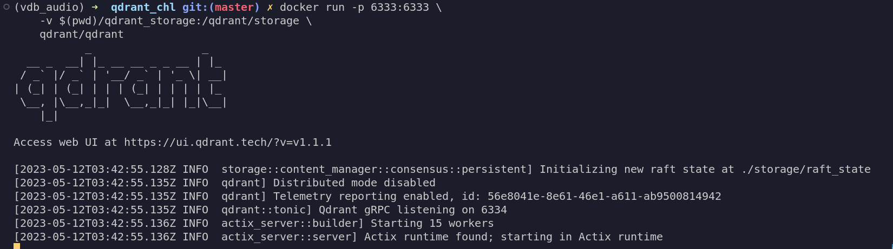

# Getting Started with Qdrant

Vector databases shine in many applications like [semantic search](https://en.wikipedia.org/wiki/Semantic_search) and [recommendation](https://en.wikipedia.org/wiki/Recommender_system), and in this tutorial, we'll learn about how to get started building these systems with one of the most popular and fastest growing vector databases in the market, [Qdrant](qdrant.tech).

## Table of Contents

1. [Learning Outcomes](##-1.-Learning-Outcomes)
2. [Installation](##-2.-Installation)
3. [Getting Started](##-3.-Getting-Started)
    - [Adding Points](###-3.1-Adding-Points)
    - [Payload](###-3.2-Payloads)
    - [Search](###-3.3-Search)
4. [Recommendations](##-4.-Recommendations)
5. [Conclusion](##-5.-Conclusion)
6. [Resources](##-6.-Resources)

## 1. Learning Outcomes

By the end of this tutorial, you will be able to
- Create, update, and query collections of vectors using Qdrant.
- Conduct semantic search based on new data.
- Develop an intuition for the mechanics behind the recommendation API of Qdrant.
- Understand, and get creative with, the kind of data you can add to your payload.

## 2. Installation

The open source version of Qdrant is available as a docker image and it can be pulled and run from any machine with docker in it. If you don't have Docker installed in your PC you can follow the instructions in the official documentation [here](https://docs.docker.com/get-docker/). After that, open your terminal start by downloading the image with the following command.

```sh
docker pull qdrant/qdrant
```

Next, initialize Qdrant with the following command, and you should be good to go.

```sh
docker run -p 6333:6333 \
    -v $(pwd)/qdrant_storage:/qdrant/storage \
    qdrant/qdrant
```

You should see something similar to the following image.



If you experience any issues during the start process, please let us know in our [discord channel here](https://qdrant.to/discord). We are always available and happy to help.

Now that you have Qdrant up and running, your next step is to pick a client to connect to it. We'll be using Python as it has the most mature data tools' ecosystem out there. So, let's start setting up our development environment and getting the libraries we'll be using today.

```sh
# with mamba or conda
mamba env create -n my_env python=3.10
mamba activate my_env

# or with virtualenv
python -m venv venv
source venv/bin/activate

# install packages
pip install qdrant-client pandas numpy faker
```

After your have your environment ready, let's get started using Qdrant.

**Note:** At the time of writing, Qdrant supports Rust, GO, Python and TypeScript. We expect other programming languages to be added in the future.

## 3. Getting Started

The two modules we'll use the most are the `QdrantClient` and the `models` one. The former allows us to connect to Qdrant or it allows us to run an in-memory database by switching the parameter `location=` to `":memory:"` (this is a great feature for testing in a CI/CD pipeline). The latter gives us access to most of the functionalities with need to interact with Qdrant.

We'll start by instantiating our client using `host="localhost"` and `port=6333` (as it is the default port we used earlier with docker). You can also follow along with the `location=":memory:"` option commented out below.


```python
from qdrant_client import QdrantClient
from qdrant_client.http import models
from qdrant_client.http.models import CollectionStatus
```


```python
client = QdrantClient(host="localhost", port=6333)
client
```


    <qdrant_client.qdrant_client.QdrantClient at 0x7fad13ebcdf0>


```python
# client = QdrantClient(location=":memory:")
# client
```

In OLTP and OLAP databases we call specific bundles of rows and columns **Tables**, but in vector databases, the rows are known as vectors, the columns are known as dimensions, and the combination of the two (plus some metadata) is a [**Collection**](https://qdrant.tech/documentation/collections/).

In the same way in which we can create many tables in an OLTP or an OLAP database, we can create many collections in a vector database like Qdrant using one of its clients. The key difference to note is that when we create a collection in Qdrant, we need to specify the width of the collection (i.e. the length of the vector or amount of dimensions) beforehand with the parameter `size=...`, as well as the distance metric with the parameter `distance=...` (which can be changed later on).

The distances currently supported by Qdrant are [**Cosine Similarity**](https://en.wikipedia.org/wiki/Cosine_similarity), [**Dot Product**](https://en.wikipedia.org/wiki/Dot_product), and [**Euclidean Distance**](https://en.wikipedia.org/wiki/Euclidean_distance).

Let's create our first collection and have the vectors be of size 100 with a distance set to **Cosine Similarity**.


```python
my_collection = "first_collection"

first_collection = client.recreate_collection(
    collection_name=my_collection,
    vectors_config=models.VectorParams(size=100, distance=models.Distance.COSINE)
)
print(first_collection)
```

    True


We can extract information related to the health of our collection by retrieving the collection with our client. In addition, we can use this information for testing purposes, which can be very beneficial while in development mode.


```python
collection_info = client.get_collection(collection_name=my_collection)
list(collection_info)
```


    [('status', <CollectionStatus.GREEN: 'green'>),
     ('optimizer_status', <OptimizersStatusOneOf.OK: 'ok'>),
     ('vectors_count', 0),
     ('indexed_vectors_count', 0),
     ('points_count', 0),
     ('segments_count', 8),
     ('config',
      CollectionConfig(params=CollectionParams(vectors=VectorParams(size=100, distance=<Distance.COSINE: 'Cosine'>, hnsw_config=None, quantization_config=None), shard_number=1, replication_factor=1, write_consistency_factor=1, on_disk_payload=True), hnsw_config=HnswConfig(m=16, ef_construct=100, full_scan_threshold=10000, max_indexing_threads=0, on_disk=False, payload_m=None), optimizer_config=OptimizersConfig(deleted_threshold=0.2, vacuum_min_vector_number=1000, default_segment_number=0, max_segment_size=None, memmap_threshold=None, indexing_threshold=20000, flush_interval_sec=5, max_optimization_threads=1), wal_config=WalConfig(wal_capacity_mb=32, wal_segments_ahead=0), quantization_config=None)),
     ('payload_schema', {})]


```python
assert collection_info.status == CollectionStatus.GREEN
assert collection_info.vectors_count == 0
```

There's a couple of things to note from what we have done so far.
- The first is that when we initiated our docker image, we created a local directory called, `qdrant_storage`, and this is where all of our collections, plus their metadata, will be saved at. Qdrant can use one of two options for [storage](https://qdrant.tech/documentation/storage/), **in-memory** storage (which stores all vectors in RAM and has the highest speed since disk access is required only for persistence), or **memmap** storage (which creates a virtual address space associated with the file on disk). You can have a look at that directory in a *nix system with `tree qdrant_storage -L 2`, and something similar to the following output should come up for you.
    ```bash
    qdrant_storage
    ├── aliases
    │   └── data.json
    ├── collections
    │   └── my_first_collection
    └── raft_state
    ```
- The second is that we used `client.recreate_collection()` and this command, as the name implies, can be used more than once to create new collections with or without the same name, so be careful no to recreate a collection that you did not intend to recreate. To create a brand new collection that cannot be recreated again, we would use `client.create_collection()` method instead.
- Our collection will hold vectors of 100 dimensions and the distance metric has been set to Cosine Similarity.

Now that we know how to create collections, let's create a bit of fake data and add some vectors to it.

### 3.1 Adding Points

The [points](https://qdrant.tech/documentation/points/) are the central entity Qdrant operates with, and these contain records consisting of a vector, an optional `id` and an optional `payload` (which we'll talk more about in the next section).

The optional id can be represented by [unsigned integers](https://en.wikipedia.org/wiki/Integer_(computer_science)) or [UUID(https://en.wikipedia.org/wiki/Universally_unique_identifier)]s but, for our use case, we will use a straightforward range of numbers.

Let's us [NumPy](https://numpy.org/) to create a matrix of fake data containing 1,000 vectors and 100 dimensions, and then represent the values as `float64` numbers between -1 and 1. For simplicity, let's imagine that each of these vectors represents one of our favorite songs, and that each column represents a unique characteristic of the song, for example, the tempo, the beats, the pitch of the voice of the singer(s), etc.


```python
import numpy as np
```


```python
data = np.random.uniform(low=-1.0, high=1.0, size=(1_000, 100))
type(data[0, 0]), data[:2, :20]
```


    (numpy.float64,
     array([[-0.05303611,  0.34459755,  0.76877484, -0.0158912 , -0.3515725 ,
             -0.92520697, -0.36416004,  0.91791994, -0.2254738 ,  0.03992614,
             -0.17834748, -0.58472613, -0.89322339,  0.13848185, -0.90751362,
              0.71058809, -0.27512001,  0.64711605,  0.30991896,  0.8896701 ],
            [-0.1296899 , -0.8325752 ,  0.46608321, -0.39436982,  0.12301721,
              0.22336377, -0.95403339,  0.30383946,  0.7568641 , -0.91504574,
              0.21398519, -0.43977382, -0.07772702,  0.02275247, -0.22655445,
             -0.02363874, -0.56423764,  0.94943287,  0.26219995,  0.62735642]]))


Let's now create an index for our vectors.


```python
index = list(range(len(data)))
index[-10:]
```


    [990, 991, 992, 993, 994, 995, 996, 997, 998, 999]


Once a collection has been created, we can fill it in with the command `client.upsert()`. We'll need the collection's name and the appropriate uploading process from our `models` module, in this case, [`Batch`](https://qdrant.tech/documentation/points/#upload-points).

One thing to note is that Qdrant can only take in native Python iterables like lists and tuples. This is why you'll notice the `.tolist()` method attached to our numpy matrix,`data`, below.


```python
client.upsert(
    collection_name=my_collection,
    points=models.Batch(
        ids=index,
        vectors=data.tolist()
    )
)
```


    UpdateResult(operation_id=0, status=<UpdateStatus.COMPLETED: 'completed'>)


We can retrieve specific points based on their ID (for example, artist X with ID 100) and get some additional information from that result.


```python
client.retrieve(
    collection_name=my_collection,
    ids=[100],
    with_vectors=True # the default is False
)
```


    [Record(id=100, payload={}, vector=[-0.03463546, -0.01026143, 0.15584062, -0.03674199, -0.10754523, -0.15643364, -0.1357449, -0.067160346, -0.0015522024, 0.030050367, -0.1336697, 0.12108152, 0.14289995, -0.06601132, 0.0067344513, 0.05278854, -0.15211268, 0.02751477, 0.013617064, 0.07691656, 0.14334463, 0.078325845, -0.067150295, 0.13005906, 0.016733043, -0.09850788, 0.071991354, 0.03699084, -0.13441333, -0.10449347, 0.10445317, -0.1284516, -0.14821146, 0.052959085, -0.060419794, 0.02169682, 0.1191593, 0.073885836, 0.07564473, -0.062121205, -0.15273724, -0.15505096, 0.042748712, -0.020586135, -0.13603596, 0.14455841, 0.10489224, -0.120181546, 0.052598357, -0.16265365, -0.15380295, 0.11495946, 0.062300652, -0.101409845, 0.14395215, -0.16222608, 0.06593911, 0.1173012, 0.12055558, -0.009821507, 0.020054886, 0.04771211, -0.022454012, 0.118841976, -0.0491934, -0.09702059, 0.064038, 0.124456346, 0.13849476, 0.06234425, -0.06864697, 0.032732993, 0.15420534, 0.14516357, 0.03705083, -0.014671113, -0.12554511, -0.103203796, 0.03705848, -0.12491126, -0.14011686, -0.08283738, 0.07958351, 0.009932304, -0.029494055, 0.07196128, 0.08827084, 0.08012733, -0.14970517, -0.12099693, -0.114456914, 0.044483785, -0.07360799, -0.045856647, 0.096695036, -0.14971526, -0.0643105, -0.14583696, -0.08727498, 0.15599053])]


We can also update our collection one point at a time, for example, as new data comes in.


```python
def create_song():
    return np.random.uniform(low=-1.0, high=1.0, size=100).tolist()
```


```python
client.upsert(
    collection_name=my_collection,
    points=[
        models.PointStruct(
            id=1000,
            vector=create_song(),
        )
    ]
)
```


    UpdateResult(operation_id=1, status=<UpdateStatus.COMPLETED: 'completed'>)


We can also delete it in a straightforward fashion.


```python
# this will show the amount of vectors BEFORE deleting the one we just created
client.count(
    collection_name=my_collection, 
    exact=True,
) 
```


    CountResult(count=1001)


```python
client.delete(
    collection_name=my_collection,
    points_selector=models.PointIdsList(
        points=[1000],
    ),
)
```


    UpdateResult(operation_id=2, status=<UpdateStatus.COMPLETED: 'completed'>)


```python
# this will show the amount of vectors AFTER deleting them
client.count(
    collection_name=my_collection, 
    exact=True,
)
```


    CountResult(count=1000)


### 3.2 Payloads

Qdrant has incredible features on top of speed and reliability, and one of its most useful ones is without a doubt the ability to store additional information alongside the vectors. In Qdrant's terminology, this information is considered a [payload](https://qdrant.tech/documentation/payload/) and it is represented as JSON objects. With these payloads, not only can you get information back when you search in the database, but you can also filter your search by the parameters in the payload, and we'll see how in a second.

Imagine the fake vectors we created actually represented a song. If we were building a semantic search system for songs then, naturally, the things we would want to get back would be the song itself (or an URL to it), the artist, maybe the genre, and so on.

What we'll do here is to take advantage of a Python package call `faker` and create a bit of information to add to our payload and see how this functionality works.


```python
from faker import Faker
```


```python
fake_something = Faker()
fake_something.name()
```


    'Laura Sandoval'


For each vector, we'll create list of dictionaries containing the artist, the song (as a combination of 3 random words), a url to the song is at (say, s3), the year in which it was released, and the country where it originated from.


```python
payload = []

for i in range(len(data)):
    payload.append(
        {
            "artist":   fake_something.name(),
            "song":     " ".join(fake_something.words()),
            "url_song": fake_something.url(),
            "year":     fake_something.year(),
            "country":  fake_something.country()
        }
    )

payload[:3]
```


    [{'artist': 'Francisco Benton',
      'song': 'ability something message',
      'url_song': 'http://www.smith.com/',
      'year': '1976',
      'country': 'Western Sahara'},
     {'artist': 'David Jackson',
      'song': 'public and better',
      'url_song': 'http://russell-faulkner.biz/',
      'year': '1974',
      'country': 'Barbados'},
     {'artist': 'Patrick Galvan',
      'song': 'through evening product',
      'url_song': 'https://miller.com/',
      'year': '1992',
      'country': 'Korea'}]


We can upsert our Points (ids, data, and payload), with the same `client.upsert()` method we used earlier, and we can retrieve any one song with the `client.retrieve()` method.


```python
client.upsert(
    collection_name=my_collection,
    points=models.Batch(
        ids=index,
        vectors=data.tolist(),
        payloads=payload
    )
)
```


    UpdateResult(operation_id=3, status=<UpdateStatus.COMPLETED: 'completed'>)


```python
resutls = client.retrieve(
    collection_name=my_collection,
    ids=[10, 50, 100, 500],
    with_vectors=False
)

type(resutls), resutls
```


    (list,
     [Record(id=500, payload={'artist': 'Arthur White', 'country': 'Taiwan', 'song': 'late citizen job', 'url_song': 'https://www.wilson.info/', 'year': '1976'}, vector=None),
      Record(id=100, payload={'artist': 'Kyle Livingston', 'country': 'Isle of Man', 'song': 'through opportunity start', 'url_song': 'http://osborn-byrd.com/', 'year': '2003'}, vector=None),
      Record(id=50, payload={'artist': 'Daniel Mullins', 'country': 'Sao Tome and Principe', 'song': 'drive grow article', 'url_song': 'https://adams.com/', 'year': '1977'}, vector=None),
      Record(id=10, payload={'artist': 'Darrell Walsh', 'country': 'Congo', 'song': 'story most to', 'url_song': 'http://stevens-myers.com/', 'year': '1988'}, vector=None)])


What we got back is a list with records and each element inside a record can be accessed as an attribute, e.g. `.payload` or `.id`.


```python
resutls[0].payload
```


    {'artist': 'Arthur White',
     'country': 'Taiwan',
     'song': 'late citizen job',
     'url_song': 'https://www.wilson.info/',
     'year': '1976'}


```python
resutls[0].id
```


    500


Next, we'll use our payload it to search.

### 3.3 Search

Now that we have our vectors with an ID and a payload, we can explore a few of ways in which we can search for content when, in our use case, new music gets selected. Let's check it out.

Say, for example, that a new song (like ["living la vida loca"](https://www.youtube.com/watch?v=p47fEXGabaY&ab_channel=RickyMartinVEVO) by Ricky Martin) comes in and our model immediately transforms it into a vector. Since we don't want a large amount of values back, let's limit the search to a few points.


```python
living_la_vida_loca = create_song()
```


```python
client.search(
    collection_name=my_collection,
    query_vector=living_la_vida_loca,
    limit=3
)
```


    [ScoredPoint(id=899, version=3, score=0.27792826, payload={'artist': 'Billy Lynch', 'country': 'Morocco', 'song': 'speech front another', 'url_song': 'https://www.kim.com/', 'year': '1972'}, vector=None),
     ScoredPoint(id=93, version=3, score=0.277919, payload={'artist': 'Austin Aguilar', 'country': 'Reunion', 'song': 'computer rise president', 'url_song': 'http://lane.com/', 'year': '2009'}, vector=None),
     ScoredPoint(id=852, version=3, score=0.2773033, payload={'artist': 'Jennifer Chavez', 'country': 'Korea', 'song': 'recognize other defense', 'url_song': 'https://www.harris.com/', 'year': '1970'}, vector=None)]


Now imagine that we only want Australian songs recommended to us. For this, we can filter the query using the information in the payload. We'll first create a filter object and pass it to our search method as an argument to the parameter `query_filter=`.


```python
aussie_songs = models.Filter(
    must=[models.FieldCondition(key="country", match=models.MatchValue(value="Australia"))]
)
type(aussie_songs)
```


    qdrant_client.http.models.models.Filter


```python
client.search(
    collection_name=my_collection,
    query_vector=living_la_vida_loca,
    query_filter=aussie_songs,
    limit=2
)
```


    [ScoredPoint(id=57, version=3, score=0.07630251, payload={'artist': 'Robert Lucas', 'country': 'Australia', 'song': 'this minute spend', 'url_song': 'https://olson-wyatt.com/', 'year': '1971'}, vector=None),
     ScoredPoint(id=67, version=3, score=0.046429798, payload={'artist': 'Crystal Hughes', 'country': 'Australia', 'song': 'owner different later', 'url_song': 'http://www.gonzalez-ford.com/', 'year': '2009'}, vector=None)]


Lastly, say we want aussie songs but we don't care how new or old these songs are. Let's exclude the yearfrom the payload.


```python
client.search(
    collection_name=my_collection,
    query_vector=living_la_vida_loca,
    query_filter=aussie_songs,
    with_payload=models.PayloadSelectorExclude(exclude=["year"]),
    limit=5
)
```


    [ScoredPoint(id=57, version=3, score=0.07630251, payload={'artist': 'Robert Lucas', 'country': 'Australia', 'song': 'this minute spend', 'url_song': 'https://olson-wyatt.com/'}, vector=None),
     ScoredPoint(id=67, version=3, score=0.046429798, payload={'artist': 'Crystal Hughes', 'country': 'Australia', 'song': 'owner different later', 'url_song': 'http://www.gonzalez-ford.com/'}, vector=None),
     ScoredPoint(id=803, version=3, score=0.019309767, payload={'artist': 'Karen Young', 'country': 'Australia', 'song': 'base fall often', 'url_song': 'http://www.wilson-sharp.com/'}, vector=None),
     ScoredPoint(id=780, version=3, score=-0.0061590797, payload={'artist': 'Harold Mcmahon', 'country': 'Australia', 'song': 'everybody eat wife', 'url_song': 'https://www.mclaughlin.com/'}, vector=None),
     ScoredPoint(id=595, version=3, score=-0.07320782, payload={'artist': 'William Johnson', 'country': 'Australia', 'song': 'provide compare red', 'url_song': 'http://hood.com/'}, vector=None)]


As you can see, you can apply a wide-range of filtering methods to allows your users to take more control of the recommendations they are being served.

If you wanted to clear out the payload and upload a new one for the same vectors, you can use `client.clear_payload()` as below.

```python
client.clear_payload(
    collection_name=my_collection,
    points_selector=models.PointIdsList(
        points=index,
    )
)
```

## 4. Recommendations

A recommendation system is a technology that suggests items or content to users based on their preferences, interests, or past behavior. It's like having a knowledgeable friend who can recommend movies, books, music, or products that you might enjoy.

In its most widely-used form, recommendation systems work by analyzing data about you and other users. The system looks at your previous choices, such as movies you've watched, products you've bought, or articles you've read, and it then compares this information with data from other people who have similar tastes or interests. These systems are used in various companies such as Netflix, Amazon, Tik-Tok, and Spotify. They aim to personalize your experience, save you time searching for things you might like, or introduce you to new and relevant content that you may not have discovered otherwise.

In a nutshell, a recommendation system is a smart tool that helps you discover new things you'll probably enjoy based on your preferences and the experiences of others.

Qdrant offers a convenient API that allows you to take into account user feedback by including similar songs to those the user have already liked (👍), or, conversely, by excluding songs that are similar to those the user has signal it did not like (👎).

The method is straightforward to implement via the `client.recommend()` method, and it provides enough flexibility that the logic on how the feedback gets capture can rest in the hands of the developers at your organization. So, what do you need to keep in mind when making recommendations with Qdrant?

- `collection_name=` - from which collection are we selecting vectors.
- `query_filter=` - which filter will we apply to our search, if any.
- `negative=` - are there any songs the user explicitly didn't like? If so, let's use the `id` of these songs to exclude semantically similar ones.
- `positive=` - are there any songs the user explicitly liked? If so, let's use the `id` of these songs to include semantically similar ones.
- `limit=` - how many songs should we show our user.

One last to note is that the `positive=` parameter is a required one but the negative one isn't/

With this new knowledge under our sleeves, imagine there are two songs, "[Suegra](https://www.youtube.com/watch?v=p7ff5EntWsE&ab_channel=RomeoSantosVEVO)" by Romeo Santos and "[Worst Behavior](https://www.youtube.com/watch?v=U5pzmGX8Ztg&ab_channel=DrakeVEVO)" by Drake represented by the ids 17 and 120 respectively. Let's see what we would get with the former being a 👍 and the latter being a 👎.


```python
client.recommend(
    collection_name=my_collection,
    query_vector=living_la_vida_loca,
    positive=[17],
    limit=5
)
```


    [ScoredPoint(id=46, version=3, score=0.3310853, payload={'artist': 'Felicia Yang', 'country': 'Brunei Darussalam', 'song': 'pattern help within', 'url_song': 'http://www.gonzalez.biz/', 'year': '2006'}, vector=None),
     ScoredPoint(id=840, version=3, score=0.3030827, payload={'artist': 'Charles Brown', 'country': 'Somalia', 'song': 'network national very', 'url_song': 'https://www.larson-hartman.com/', 'year': '1975'}, vector=None),
     ScoredPoint(id=771, version=3, score=0.2851892, payload={'artist': 'Lori Clark', 'country': 'Myanmar', 'song': 'why box back', 'url_song': 'https://sanchez-waters.biz/', 'year': '1992'}, vector=None),
     ScoredPoint(id=304, version=3, score=0.28324583, payload={'artist': 'Steven Fitzgerald', 'country': 'Kyrgyz Republic', 'song': 'so suddenly indicate', 'url_song': 'http://www.stevens.com/', 'year': '1994'}, vector=None),
     ScoredPoint(id=544, version=3, score=0.26716217, payload={'artist': 'Christopher Bowman', 'country': 'Yemen', 'song': 'strategy late same', 'url_song': 'http://herrera.com/', 'year': '2012'}, vector=None)]


```python
client.recommend(
    collection_name=my_collection,
    query_vector=living_la_vida_loca,
    positive=[17],
    negative=[120],
    limit=5
)
```


    [ScoredPoint(id=756, version=3, score=0.31679478, payload={'artist': 'Chad Garza', 'country': 'Namibia', 'song': 'movie find method', 'url_song': 'http://www.moore.com/', 'year': '2018'}, vector=None),
     ScoredPoint(id=46, version=3, score=0.2964203, payload={'artist': 'Felicia Yang', 'country': 'Brunei Darussalam', 'song': 'pattern help within', 'url_song': 'http://www.gonzalez.biz/', 'year': '2006'}, vector=None),
     ScoredPoint(id=233, version=3, score=0.28002173, payload={'artist': 'Julie King', 'country': 'Congo', 'song': 'since really house', 'url_song': 'https://williams.com/', 'year': '1971'}, vector=None),
     ScoredPoint(id=349, version=3, score=0.25943768, payload={'artist': 'Geoffrey Wagner', 'country': 'Zimbabwe', 'song': 'station condition candidate', 'url_song': 'https://jackson.net/', 'year': '2015'}, vector=None),
     ScoredPoint(id=304, version=3, score=0.2552938, payload={'artist': 'Steven Fitzgerald', 'country': 'Kyrgyz Republic', 'song': 'so suddenly indicate', 'url_song': 'http://www.stevens.com/', 'year': '1994'}, vector=None)]


Notice that, while the similarity scores are completely random for this example, it is important that we pay attention to the scores we get back when serving recommendations in production. Even if we get 5 vectors back, it might more useful to show random results rather than vectors that are 0.012 similar to the query vector. With this in mind, we can actually set a threshold for our vectors with the `score_threshold=` parameter.


```python
client.recommend(
    collection_name=my_collection,
    query_vector=living_la_vida_loca,
    positive=[17],
    negative=[120, 180],
    score_threshold=0.22,
    limit=5
)
```


    [ScoredPoint(id=756, version=3, score=0.3045847, payload={'artist': 'Chad Garza', 'country': 'Namibia', 'song': 'movie find method', 'url_song': 'http://www.moore.com/', 'year': '2018'}, vector=None),
     ScoredPoint(id=304, version=3, score=0.28136152, payload={'artist': 'Steven Fitzgerald', 'country': 'Kyrgyz Republic', 'song': 'so suddenly indicate', 'url_song': 'http://www.stevens.com/', 'year': '1994'}, vector=None),
     ScoredPoint(id=274, version=3, score=0.28093755, payload={'artist': 'Kimberly Suarez', 'country': "Lao People's Democratic Republic", 'song': 'former blue people', 'url_song': 'http://spencer.com/', 'year': '1971'}, vector=None),
     ScoredPoint(id=46, version=3, score=0.26709613, payload={'artist': 'Felicia Yang', 'country': 'Brunei Darussalam', 'song': 'pattern help within', 'url_song': 'http://www.gonzalez.biz/', 'year': '2006'}, vector=None),
     ScoredPoint(id=840, version=3, score=0.25996253, payload={'artist': 'Charles Brown', 'country': 'Somalia', 'song': 'network national very', 'url_song': 'https://www.larson-hartman.com/', 'year': '1975'}, vector=None)]


Lastly, we can add filters in the same way as we did before. Note that these filters could be tags that your users get to pick such as, for example, genres including `reggeaton`, `bachata`, and `salsa` (sorry Drake), or the language of the song.


```python
client.recommend(
    collection_name=my_collection,
    query_vector=living_la_vida_loca,
    query_filter=models.Filter(
        must=[models.FieldCondition(key="country", match=models.MatchValue(value="Dominican Republic"))]
    ),
    positive=[17],
    negative=[120],
    limit=5
)
```


    [ScoredPoint(id=926, version=3, score=0.12710258, payload={'artist': 'Cody Hernandez', 'country': 'Dominican Republic', 'song': 'not hotel under', 'url_song': 'http://www.hanson.com/', 'year': '1978'}, vector=None),
     ScoredPoint(id=132, version=3, score=0.07745133, payload={'artist': 'Eric Edwards', 'country': 'Dominican Republic', 'song': 'next south yes', 'url_song': 'http://www.hall.com/', 'year': '1991'}, vector=None),
     ScoredPoint(id=242, version=3, score=0.052371096, payload={'artist': 'John Garza', 'country': 'Dominican Republic', 'song': 'executive animal our', 'url_song': 'https://www.gutierrez-johnson.net/', 'year': '2012'}, vector=None),
     ScoredPoint(id=747, version=3, score=-0.0069406265, payload={'artist': 'Steven Hughes', 'country': 'Dominican Republic', 'song': 'finally others focus', 'url_song': 'http://carroll-davis.net/', 'year': '1973'}, vector=None),
     ScoredPoint(id=247, version=3, score=-0.01010628, payload={'artist': 'Wesley Cantu', 'country': 'Dominican Republic', 'song': 'city news deal', 'url_song': 'https://www.rodriguez-hart.com/', 'year': '1996'}, vector=None)]


That's it! You have now gone over a whirlwind tour of vector databases and are ready to tackle new challenges. 😎

## 5. Conclusion

To wrap up, we have explored a bit of the fascinating world of vector databases, and we learned that these databases provide efficient storage and retrieval of high-dimensional vectors, making them ideal for similarity-based search tasks and recommendation systems. Both of these use cases can be applied in a variety of industries while helping us unlock new levels of information retrieval. In particular, recommendation systems built with Qdrant provide developers with enough flexibility to add and subtract data points that users liked or dislike, respectively, and even set up a threshold for how similar a recommendation must be before our applications can serve it.

We can't wait to see what cool applications you build with Qdrant.

If you liked this introductory tutorial, make sure you keep an eye out for new ones on our website.

## 6. Resources

Here is a list with some resources that we found useful, and that helped with the development of this tutorial.

- [Fine Tuning Similar Cars Search](https://qdrant.tech/articles/cars-recognition/)
- [Q&A with Similarity Learning](https://qdrant.tech/articles/faq-question-answering/)
- [Question Answering with LangChain and Qdrant without boilerplate](https://qdrant.tech/articles/langchain-integration/)
- [Extending ChatGPT with a Qdrant-based knowledge base](https://qdrant.tech/articles/chatgpt-plugin/)
- [Word Embedding and Word2Vec, Clearly Explained!!!](https://www.youtube.com/watch?v=viZrOnJclY0&ab_channel=StatQuestwithJoshStarmer) by StatQuest with Josh Starmer
- [Word Embeddings, Bias in ML, Why You Don't Like Math, & Why AI Needs You](https://www.youtube.com/watch?v=25nC0n9ERq4&ab_channel=RachelThomas) by Rachel Thomas
