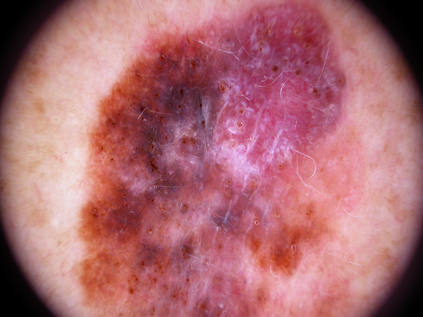
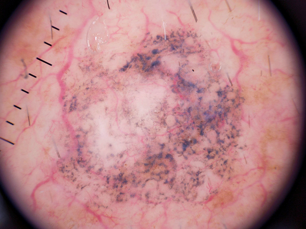

# Qdrant & Image Data


In this tutorial, you will learn how use semantic search for accurate skin cancer image comparison usign Qdrant and the 
Hugging Face `transformers` and `datasets` libraries.

## 1. Overview

This aim of this tutorial is to walk you through the process of implementing semantic search techniques with image data and
vector databases. In particular, we'll go over an example on how to assist doctors in comparing rare or challenging images 
with labels representing different skin diseases. 

Why did we choose this example? With the power of semantic search, medical professionals could enhance 
their diagnostic capabilities and make more accurate decisions regarding skin disease diagnosis. Effectively helping out 
people in need of such medical evaluations.

That said, you can swap the dataset used in this tutorial with your own and follow along with minimal adjustments to the code. 

The dataset used can be found in the [Hugging Face Hub](https://huggingface.co/datasets/marmal88/skin_cancer) and you don't 
need to take any additional step to download it other than to run the code below.

Here is a short description of each of the variables available in the dataset.
- `image` - PIL objct of size 600x450
- `image_id` - unique id for the image
- `lesion_id` - unique id for the type of lesion on the skin of the patient
- `dx` - diagnosis given to the patient (e.g., melanocytic_Nevi, melanoma, benign_keratosis-like_lesions, basal_cell_carcinoma, 
actinic_keratoses, vascular_lesions, dermatofibroma)
- `dx_type` - type of diagnosis (e.g., histo, follow_up, consensus, confocal)
- `age` - the age of the patients from 5 to 86 (some values are missing)
- `sex` - the gender of the patient (female, male, and unknown)
- `localization` - location of the spot in the body (e.g., 'lower extremity', 'upper extremity', 'neck', 'face', 'back', 
'chest', 'ear', 'abdomen', 'scalp', 'hand', 'trunk', 'unknown', 'foot', 'genital', 'acral')

By the end of the tutorial, you will be able to extract embeddings from images using transformers and conduct image-to-image 
semantic search with Qdrant. Please note, we do assume a bit of familiarity with machine learning and vector databases concepts.

## 2. Set Up

Before you run any line of code, please make sure you have 
1. downloaded the data
2. created a virtual environment (if not in Google Colab)
3. installed the packages below
4. started a container with Qdrant

```bash
# with conda or mamba if you have it installed
mamba env create -n my_env python=3.10
mamba activate my_env

# or with virtualenv
python -m venv venv
source venv/bin/activate

# install packages
pip install qdrant-client transformers datasets torch numpy
```

The open source version of Qdrant is available as a docker image and it can be pulled and run from any machine with docker 
installed. If you don't have Docker installed in your PC you can follow the instructions in the official documentation 
[here](https://docs.docker.com/get-docker/). After that, open your terminal and start by downloading the latest Qdrant 
image with the following command.

```sh
docker pull qdrant/qdrant
```

Next, initialize Qdrant with the following command, and you should be good to go.

```sh
docker run -p 6333:6333 \
    -v $(pwd)/qdrant_storage:/qdrant/storage \
    qdrant/qdrant
```

Verify that you are ready to go by importing the following libraries and connecting to Qdrant via its Python client.


```python
from transformers import ViTImageProcessor, ViTModel
from qdrant_client import QdrantClient
from qdrant_client.http import models
from datasets import load_dataset
import numpy as np
import torch
```


```python
client = QdrantClient(host="localhost", port=6333)
```


```python
my_collection = "image_collection"
client.recreate_collection(
    collection_name=my_collection,
    vectors_config=models.VectorParams(size=384, distance=models.Distance.COSINE)
)
```


    True


## 3. Image Embeddings

In computer vision systems, vector databases are used to store image features. These image features are vector representations 
of images that capture their visual content, and they are used to improve the performance of computer vision tasks such 
as object detection, image classification, and image retrieval.

To extract these useful feature representation from our images, we'll use vision transformers (ViT). ViTs are advanced 
algorithms that enable computers to "see" and understand visual information in a similar fashion to humans. They 
use a transformer architecture to process images and extract meaningful features from them.

To understand how ViTs work, imagine you have a large jigsaw puzzle with many different pieces. To solve the puzzle, 
you would typically look at the individual pieces, their shapes, and how they fit together to form the full picture. ViTs 
work in a similar way, meaning, instead of looking at the entire image at once, vision transformers break it down 
into smaller parts called "patches." Each of these patches is like one piece of the puzzle that captures a specific portion 
of the image, and these pieces are then analyzed and processed by the ViTs.

By analyzing these patches, the ViTs identify important patterns such as edges, colors, and textures, and combines them 
to form a coherent understanding of a given image.

That said, let's get started using transformers to extract features from our images.

We'll begin by reading in the data and examining a sample.


```python
dataset = load_dataset("marmal88/skin_cancer", split='train')
dataset
```

    Found cached dataset parquet (/home/ramonperez/.cache/huggingface/datasets/marmal88___parquet/marmal88--skin_cancer-4d80d9330324f110/0.0.0/2a3b91fbd88a2c90d1dbbb32b460cf621d31bd5b05b934492fdef7d8d6f236ec)


    Dataset({
        features: ['image', 'image_id', 'lesion_id', 'dx', 'dx_type', 'age', 'sex', 'localization'],
        num_rows: 9577
    })


```python
dataset[8500]
```


    {'image': <PIL.JpegImagePlugin.JpegImageFile image mode=RGB size=600x450>,
     'image_id': 'ISIC_0025927',
     'lesion_id': 'HAM_0002557',
     'dx': 'melanoma',
     'dx_type': 'histo',
     'age': 50.0,
     'sex': 'female',
     'localization': 'upper extremity'}


```python
image = dataset[8500]["image"]
image
```


    

    


The image at index 8500, as shown above, is an instance of melanoma, which is a type of skin cancer that starts 
in the cells called melanocytes. These are responsible for producing a pigment called melanin that gives color 
to our skin, hair, and eyes. When melanocytes become damaged or mutate, they can start growing and dividing rapidly, 
forming a cancerous growth known as melanoma. Melanoma often appears as an unusual or changing mole, spot, or 
growth on the skin, and it can be caused by excessive exposure to ultraviolet (UV) radiation from the sun or 
tanning beds, as well as genetic factors. If detected early, melanoma can usually be treated successfully, 
but if left untreated, it can spread to other parts of the body and become more difficult to treat.

Because Melanoma can often be hard to detect, and we want to empower doctors with the ability to compare 
and contrast cases that are difficult to classify without invasive procedures (i.e., by taking a sample of the 
skin of the patient), we will create for them a system that allows them to compare images taken from patients 
with those already inside Qdrant in the shape of a vector.

In order to search through the images and provide the most similar ones to the doctors, we'll need to download 
a pre-trained model that will help us extract the embedding layer from our dataset. We'll do this using the 
transformers library and Facebook's [DINO model](https://huggingface.co/facebook/dino-vitb8).


```python
device = torch.device("cuda" if torch.cuda.is_available() else "cpu")
processor = ViTImageProcessor.from_pretrained('facebook/dino-vits16')
model = ViTModel.from_pretrained('facebook/dino-vits16').to(device)
```

    Some weights of ViTModel were not initialized from the model checkpoint at facebook/dino-vits16 and are newly initialized: ['pooler.dense.weight', 'pooler.dense.bias']
    You should probably TRAIN this model on a down-stream task to be able to use it for predictions and inference.


Let's process the instance of melanoma we selected earlier using our feature extractor from above. To learn more about `ViTImageProcessor` 
and `ViTModel`, check out the [docs here](https://huggingface.co/docs/transformers/tasks/image_classification).


```python
inputs = processor(images=image, return_tensors="pt").to(device)
inputs['pixel_values'].shape, inputs
```


    (torch.Size([1, 3, 224, 224]),
     {'pixel_values': tensor([[[[-1.3987, -1.4329, -1.4500,  ..., -1.0904, -1.1075, -1.0904],
               [-1.4158, -1.4329, -1.4500,  ..., -1.0904, -1.1075, -1.1075],
               [-1.4329, -1.4500, -1.4500,  ..., -1.1247, -1.1075, -1.1075],
               ...,
               [-1.1075, -1.1075, -1.0904,  ..., -1.4843, -1.5014, -1.5357],
               [-1.1075, -1.1075, -1.0904,  ..., -1.4843, -1.5185, -1.5528],
               [-1.1247, -1.1247, -1.0904,  ..., -1.4843, -1.5357, -1.5528]],
     
              [[-1.7381, -1.7381, -1.7556,  ..., -1.5980, -1.6155, -1.6331],
               [-1.7381, -1.7381, -1.7556,  ..., -1.6155, -1.6331, -1.6506],
               [-1.7381, -1.7381, -1.7556,  ..., -1.5980, -1.6155, -1.6155],
               ...,
               [-1.5630, -1.5630, -1.5630,  ..., -1.7731, -1.7906, -1.7906],
               [-1.5630, -1.5630, -1.5630,  ..., -1.7906, -1.7906, -1.8081],
               [-1.5805, -1.5805, -1.5630,  ..., -1.7906, -1.8081, -1.8081]],
     
              [[-1.3513, -1.3687, -1.3861,  ..., -1.2119, -1.2119, -1.2293],
               [-1.3687, -1.3687, -1.3861,  ..., -1.2119, -1.2293, -1.2467],
               [-1.3687, -1.3861, -1.4036,  ..., -1.2119, -1.2119, -1.2293],
               ...,
               [-1.1770, -1.1770, -1.1596,  ..., -1.4559, -1.4907, -1.5081],
               [-1.1596, -1.1770, -1.1596,  ..., -1.4733, -1.4907, -1.5081],
               [-1.1596, -1.1770, -1.1770,  ..., -1.4733, -1.4733, -1.5081]]]],
            device='cuda:0')})


```python
one_embedding = model(**inputs).last_hidden_state
one_embedding.shape, one_embedding[0, 0, :20]
```


    (torch.Size([1, 197, 384]),
     tensor([ 3.0854,  4.9196, -1.1094,  3.3949, -0.8139,  4.8751,  4.4032, -0.6903,
              5.5181,  8.6680,  1.6411,  5.6704,  2.2703, -1.3895, -1.8102, -1.4204,
              8.9997,  8.5076,  5.1398, -7.1862], device='cuda:0',
            grad_fn=<SliceBackward0>))


As you can see above, what we get back from our preprocessing function is a multi-dimensional tensor represented 
as [`batch_size`, `channels`, `rows`, `columns`]. The `batch_size` is the amount of samples passed through our 
feature extractor and the channels represent the red, green, and blue hues of the image. Lastly, the rows and 
columns, which can also be thought of as vectors and dimensions, represent the width and height of the image. This 
4-dimensional representation is the input our model expects. In return, we get back a tensor 
of [`batch_size`, `patches`, `dimensions`], and what's left for us to do is to choose a pooling method 
for our embedding as it is not feasible to use 197 embedding vectors when one compressed one would suffice for our use 
case. For the final step, we'll use mean pooling.


```python
one_embedding.mean(dim=1).shape
```


    torch.Size([1, 384])


Let's create a function with the process we just walked through above and map it to our dataset to get an 
embedding vector for each image.


```python
def get_embeddings(batch):
    inputs = processor(images=batch['image'], return_tensors="pt").to(device)
    with torch.no_grad():
        outputs = model(**inputs).last_hidden_state.mean(dim=1).cpu().numpy()
    batch['embeddings'] = outputs
    return batch
```


```python
dataset = dataset.map(get_embeddings, batched=True, batch_size=16)
```


    Map:   0%|          | 0/9577 [00:00<?, ? examples/s]


```python
dataset
```

Notice above that we now have an embedding for each of the images in our dataset, and that's exactly what we were hoping for.

We'll now save the vector of embeddings as a NumPy array so that we don't have to run it again later if 
take a break or accidentally close down the tutorial. Then, what we want to do is to create a payload 
with the metadata about each of our images. We can accomplish this by converting the rest of the 
columns we didn't use into a JSON object for each sample.


```python
np.save("vectors", np.array(dataset['embeddings']), allow_pickle=False)
```


```python
payload = dataset.select_columns([
    "image_id", 'dx', 'dx_type', 'age', 'sex', 'localization'
]).to_pandas().fillna({"age": 0}).to_dict(orient="records")

payload[:3]
```


    [{'image_id': 'ISIC_0024329',
      'dx': 'actinic_keratoses',
      'dx_type': 'histo',
      'age': 75.0,
      'sex': 'female',
      'localization': 'lower extremity'},
     {'image_id': 'ISIC_0024372',
      'dx': 'actinic_keratoses',
      'dx_type': 'histo',
      'age': 70.0,
      'sex': 'male',
      'localization': 'lower extremity'},
     {'image_id': 'ISIC_0024418',
      'dx': 'actinic_keratoses',
      'dx_type': 'histo',
      'age': 75.0,
      'sex': 'female',
      'localization': 'lower extremity'}]


Note that in the cell above we use `.fillna({"age": 0})`, that is because there are several missing values in the `age` column. Because 
we don't want to assume the age of a patient, we'll leave this number as 0. Also, at the time of writing, Qdrant will not take in NumPy 
`NaN`s but rather regular `None` Python values for anything that might be missing in our dataset.

To make sure each image has an explicit `id` inside of the Qdrant collection we created earlier, we'll create a new column with a range of 
numbers equivalent to the rows in our dataset. In addition, we'll load the embeddings we just saved.


```python
ids = list(range(dataset.num_rows))
embeddings = np.load("vectors.npy").tolist()
```

We are now ready to upsert the combination of ids, vectors and payload to our collection, and we'll do so in batches of 1000.


```python
batch_size = 1000

for i in range(0, dataset.num_rows, batch_size):

    low_idx = min(i+batch_size, dataset.num_rows)

    batch_of_ids = ids[i: low_idx]
    batch_of_embs = embeddings[i: low_idx]
    batch_of_payloads = payload[i: low_idx]

    client.upsert(
        collection_name=my_collection,
        points=models.Batch(
            ids=batch_of_ids,
            vectors=batch_of_embs,
            payloads=batch_of_payloads
        )
    )
```

We can make sure our vectors were uploaded successfully by counting them with the `client.count()` method.


```python
client.count(
    collection_name=my_collection, 
    exact=True,
)
```


    CountResult(count=9577)


To visually inspect the collection we just created, we can scroll through our vectors with the `client.scroll()` method.


```python
client.scroll(
    collection_name=my_collection,
    limit=5
)
```


    ([Record(id=0, payload={'age': 75.0, 'dx': 'actinic_keratoses', 'dx_type': 'histo', 'image_id': 'ISIC_0024329', 'localization': 'lower extremity', 'sex': 'female'}, vector=None),
      Record(id=1, payload={'age': 70.0, 'dx': 'actinic_keratoses', 'dx_type': 'histo', 'image_id': 'ISIC_0024372', 'localization': 'lower extremity', 'sex': 'male'}, vector=None),
      Record(id=2, payload={'age': 75.0, 'dx': 'actinic_keratoses', 'dx_type': 'histo', 'image_id': 'ISIC_0024418', 'localization': 'lower extremity', 'sex': 'female'}, vector=None),
      Record(id=3, payload={'age': 50.0, 'dx': 'actinic_keratoses', 'dx_type': 'histo', 'image_id': 'ISIC_0024450', 'localization': 'upper extremity', 'sex': 'male'}, vector=None),
      Record(id=4, payload={'age': 50.0, 'dx': 'actinic_keratoses', 'dx_type': 'histo', 'image_id': 'ISIC_0024463', 'localization': 'upper extremity', 'sex': 'male'}, vector=None)],
     5)


## 4. Semantic Search

Semantic search, in the context of vector databases and image retrieval, refers to a method of searching for information or images 
based on their meaning or content rather than just using keywords. Imagine you're looking for a specific picture of a skin disease and you 
don't know the file name or where it is stored. With semantic search, you can describe what you're looking for using words like 
"red rashes with blisters," or you can upload an image that will get processed into an embedding vector, and the system will then analyze 
the content of the images to find matches that closely match your description or input image.

Semantic search enables a more intuitive and efficient way of searching for images, making it easier to find what you're 
looking for, even if you can't remember specific details or tags.

With Qdrant, we can get started searching through our collection with the `client.search()` method.


```python
client.search(
    collection_name=my_collection,
    query_vector=one_embedding.mean(dim=1)[0].tolist(),
    limit=10
)
```


    [ScoredPoint(id=8500, version=8, score=1.0, payload={'age': 50.0, 'dx': 'melanoma', 'dx_type': 'histo', 'image_id': 'ISIC_0025927', 'localization': 'upper extremity', 'sex': 'female'}, vector=None),
     ScoredPoint(id=9205, version=9, score=0.92966413, payload={'age': 55.0, 'dx': 'melanoma', 'dx_type': 'histo', 'image_id': 'ISIC_0033269', 'localization': 'back', 'sex': 'female'}, vector=None),
     ScoredPoint(id=9420, version=9, score=0.9249702, payload={'age': 35.0, 'dx': 'melanoma', 'dx_type': 'histo', 'image_id': 'ISIC_0034216', 'localization': 'abdomen', 'sex': 'male'}, vector=None),
     ScoredPoint(id=9241, version=9, score=0.9203314, payload={'age': 55.0, 'dx': 'melanoma', 'dx_type': 'histo', 'image_id': 'ISIC_0033426', 'localization': 'back', 'sex': 'male'}, vector=None),
     ScoredPoint(id=968, version=0, score=0.9159926, payload={'age': 80.0, 'dx': 'benign_keratosis-like_lesions', 'dx_type': 'consensus', 'image_id': 'ISIC_0025851', 'localization': 'face', 'sex': 'female'}, vector=None),
     ScoredPoint(id=8510, version=8, score=0.9090265, payload={'age': 55.0, 'dx': 'melanoma', 'dx_type': 'histo', 'image_id': 'ISIC_0026086', 'localization': 'upper extremity', 'sex': 'male'}, vector=None),
     ScoredPoint(id=9009, version=9, score=0.90100396, payload={'age': 75.0, 'dx': 'melanoma', 'dx_type': 'histo', 'image_id': 'ISIC_0032244', 'localization': 'face', 'sex': 'female'}, vector=None),
     ScoredPoint(id=9037, version=9, score=0.8995733, payload={'age': 70.0, 'dx': 'melanoma', 'dx_type': 'histo', 'image_id': 'ISIC_0032511', 'localization': 'scalp', 'sex': 'male'}, vector=None),
     ScoredPoint(id=180, version=0, score=0.896978, payload={'age': 80.0, 'dx': 'actinic_keratoses', 'dx_type': 'histo', 'image_id': 'ISIC_0029417', 'localization': 'neck', 'sex': 'female'}, vector=None),
     ScoredPoint(id=1377, version=1, score=0.89676726, payload={'age': 85.0, 'dx': 'benign_keratosis-like_lesions', 'dx_type': 'histo', 'image_id': 'ISIC_0029613', 'localization': 'chest', 'sex': 'female'}, vector=None)]


As you can see in the cell above, we used the melanoma image from earlier and got back other images with Melanoma. The similarity 
score also gives us a good indication regarding the similarity of our query image and those in our database (excluding the first one 
which is the image itself, of course). But what if our doctors want to look for images from patients as demographically similar 
to the one they are evaluating. For this, we can take advantage of Qdrant's Filters.


```python
female_older_than_55 = models.Filter(
    must=[
        models.FieldCondition(key="sex", match=models.MatchValue(value="female")),
    ],
    should=[
        models.FieldCondition(key="age", range=models.Range(lt=None, gt=None, gte=55.0, lte=None))
    ]
)
```


```python
results = client.search(
    collection_name=my_collection,
    query_vector=one_embedding.mean(dim=1)[0].tolist(),
    query_filter=female_older_than_55,
    limit=10
)
results
```


    [ScoredPoint(id=9205, version=9, score=0.92966413, payload={'age': 55.0, 'dx': 'melanoma', 'dx_type': 'histo', 'image_id': 'ISIC_0033269', 'localization': 'back', 'sex': 'female'}, vector=None),
     ScoredPoint(id=968, version=0, score=0.9159926, payload={'age': 80.0, 'dx': 'benign_keratosis-like_lesions', 'dx_type': 'consensus', 'image_id': 'ISIC_0025851', 'localization': 'face', 'sex': 'female'}, vector=None),
     ScoredPoint(id=9009, version=9, score=0.90100396, payload={'age': 75.0, 'dx': 'melanoma', 'dx_type': 'histo', 'image_id': 'ISIC_0032244', 'localization': 'face', 'sex': 'female'}, vector=None),
     ScoredPoint(id=180, version=0, score=0.896978, payload={'age': 80.0, 'dx': 'actinic_keratoses', 'dx_type': 'histo', 'image_id': 'ISIC_0029417', 'localization': 'neck', 'sex': 'female'}, vector=None),
     ScoredPoint(id=1377, version=1, score=0.89676726, payload={'age': 85.0, 'dx': 'benign_keratosis-like_lesions', 'dx_type': 'histo', 'image_id': 'ISIC_0029613', 'localization': 'chest', 'sex': 'female'}, vector=None),
     ScoredPoint(id=8943, version=8, score=0.8930568, payload={'age': 75.0, 'dx': 'melanoma', 'dx_type': 'histo', 'image_id': 'ISIC_0031479', 'localization': 'lower extremity', 'sex': 'female'}, vector=None),
     ScoredPoint(id=8372, version=8, score=0.89245445, payload={'age': 75.0, 'dx': 'melanoma', 'dx_type': 'histo', 'image_id': 'ISIC_0024400', 'localization': 'unknown', 'sex': 'female'}, vector=None),
     ScoredPoint(id=9301, version=9, score=0.88872796, payload={'age': 75.0, 'dx': 'melanoma', 'dx_type': 'histo', 'image_id': 'ISIC_0033678', 'localization': 'back', 'sex': 'female'}, vector=None),
     ScoredPoint(id=9118, version=9, score=0.8857581, payload={'age': 85.0, 'dx': 'melanoma', 'dx_type': 'histo', 'image_id': 'ISIC_0032892', 'localization': 'back', 'sex': 'female'}, vector=None),
     ScoredPoint(id=9329, version=9, score=0.8855791, payload={'age': 75.0, 'dx': 'melanoma', 'dx_type': 'histo', 'image_id': 'ISIC_0033834', 'localization': 'back', 'sex': 'female'}, vector=None)]


Notice on the payload above how we were able to match the doctors' criteria effortlessly. We can include much convoluted 
requests using the other filtering methods available in Qdrant. For more info, please check out the [docs here](https://qdrant.tech/documentation/concepts/filtering/).

It is important to figure out early whether users of our application should see the similarity score of the results of their search as 
this would give them an idea as to how useful the images might be. In addition, they could set up a similarity threshold in Qdrant 
and further distill the results they get back.

Let's evaluate visually the images we just got.


```python
def see_images(results, top_k=5):
    for i in range(top_k):
        image_id = results[i].payload['image_id']
        score    = results[i].score
        dx       = results[i].payload['dx']
        gender   = results[i].payload['sex']
        age      = results[i].payload['age']
        image = dataset.filter(
            lambda x: x == image_id, input_columns="image_id"
        ).select_columns("image")[0]['image']

        print(f"Result #{i+1}: {gender} age {age} was diagnosed with {dx}")
        print(f"This image score was {score}")
        display(image)
        print("-" * 50)
        print()
```


```python
see_images(results, 3)
```


    Filter:   0%|          | 0/9577 [00:00<?, ? examples/s]


    Result #1: female age 55.0 was diagnosed with melanoma
    This image score was 0.92966413


    

    


    --------------------------------------------------
    


    Filter:   0%|          | 0/9577 [00:00<?, ? examples/s]


    Result #2: female age 80.0 was diagnosed with benign_keratosis-like_lesions
    This image score was 0.9159926


    

    


    --------------------------------------------------
    


    Filter:   0%|          | 0/9577 [00:00<?, ? examples/s]


    Result #3: female age 75.0 was diagnosed with melanoma
    This image score was 0.90100396


    

    


    --------------------------------------------------
    


Great! All images do contain an instance of Melanoma and our search query did provide accurate results.

In critical applications where the stakes are high, it might be useful to provide doctors with a similarity 
threshold so that they can be more confident of the result they are seeing. Let's pick another image and see how to 
do this with Qdrant.


```python
another_image = dataset[7777]
print(another_image['dx'])
display(another_image['image'])
```

    melanocytic_Nevi


    

    


```python
results2 = client.search(
    collection_name=my_collection,
    query_vector=another_image['embeddings'],
    score_threshold=0.92,
    limit=20
)
results2[:7]
```


    [ScoredPoint(id=7777, version=7, score=1.0, payload={'age': 45.0, 'dx': 'melanocytic_Nevi', 'dx_type': 'histo', 'image_id': 'ISIC_0033244', 'localization': 'face', 'sex': 'male'}, vector=None),
     ScoredPoint(id=7388, version=7, score=0.96020913, payload={'age': 45.0, 'dx': 'melanocytic_Nevi', 'dx_type': 'histo', 'image_id': 'ISIC_0032574', 'localization': 'face', 'sex': 'male'}, vector=None),
     ScoredPoint(id=6586, version=6, score=0.94182134, payload={'age': 55.0, 'dx': 'melanocytic_Nevi', 'dx_type': 'consensus', 'image_id': 'ISIC_0031317', 'localization': 'neck', 'sex': 'male'}, vector=None),
     ScoredPoint(id=8920, version=8, score=0.94001937, payload={'age': 75.0, 'dx': 'melanoma', 'dx_type': 'histo', 'image_id': 'ISIC_0031118', 'localization': 'upper extremity', 'sex': 'male'}, vector=None),
     ScoredPoint(id=3825, version=3, score=0.9327799, payload={'age': 30.0, 'dx': 'melanocytic_Nevi', 'dx_type': 'histo', 'image_id': 'ISIC_0027137', 'localization': 'back', 'sex': 'female'}, vector=None),
     ScoredPoint(id=1161, version=1, score=0.9323299, payload={'age': 50.0, 'dx': 'benign_keratosis-like_lesions', 'dx_type': 'confocal', 'image_id': 'ISIC_0027735', 'localization': 'face', 'sex': 'female'}, vector=None),
     ScoredPoint(id=7505, version=7, score=0.93149436, payload={'age': 55.0, 'dx': 'melanocytic_Nevi', 'dx_type': 'histo', 'image_id': 'ISIC_0032769', 'localization': 'upper extremity', 'sex': 'male'}, vector=None)]


We can see that none of the results that came back have a cosine similarity score of less than 92%, and this 
exactly the behaviour we were expecting. Now, what if the dermatologist evaluating the results wanted to search 
only through specific images because they remembered these were very similar spots to those on the current 
patient's skin? The answer is that we could explicitly give the dermatologist a way to search images that match an id. 
Let's create range of ids from 5000 to 6000 in steps of 20, and have our query return only vectors in this range.


```python
a_random_range = list(range(5000, 6000, 20))
client.search(
    collection_name=my_collection,
    query_vector=another_image['embeddings'],
    query_filter=models.Filter(must=[models.HasIdCondition(has_id=a_random_range)]),
    limit=10
)
```


    [ScoredPoint(id=5940, version=5, score=0.8642086, payload={'age': 60.0, 'dx': 'melanocytic_Nevi', 'dx_type': 'follow_up', 'image_id': 'ISIC_0030374', 'localization': 'abdomen', 'sex': 'male'}, vector=None),
     ScoredPoint(id=5180, version=5, score=0.85313225, payload={'age': 50.0, 'dx': 'melanocytic_Nevi', 'dx_type': 'follow_up', 'image_id': 'ISIC_0029205', 'localization': 'back', 'sex': 'female'}, vector=None),
     ScoredPoint(id=5980, version=5, score=0.85215414, payload={'age': 40.0, 'dx': 'melanocytic_Nevi', 'dx_type': 'histo', 'image_id': 'ISIC_0030429', 'localization': 'scalp', 'sex': 'female'}, vector=None),
     ScoredPoint(id=5680, version=5, score=0.84486425, payload={'age': 40.0, 'dx': 'melanocytic_Nevi', 'dx_type': 'follow_up', 'image_id': 'ISIC_0029981', 'localization': 'upper extremity', 'sex': 'female'}, vector=None),
     ScoredPoint(id=5840, version=5, score=0.8423323, payload={'age': 45.0, 'dx': 'melanocytic_Nevi', 'dx_type': 'follow_up', 'image_id': 'ISIC_0030221', 'localization': 'trunk', 'sex': 'female'}, vector=None),
     ScoredPoint(id=5800, version=5, score=0.84054893, payload={'age': 30.0, 'dx': 'melanocytic_Nevi', 'dx_type': 'follow_up', 'image_id': 'ISIC_0030162', 'localization': 'back', 'sex': 'female'}, vector=None),
     ScoredPoint(id=5620, version=5, score=0.83443904, payload={'age': 50.0, 'dx': 'melanocytic_Nevi', 'dx_type': 'follow_up', 'image_id': 'ISIC_0029892', 'localization': 'trunk', 'sex': 'female'}, vector=None),
     ScoredPoint(id=5220, version=5, score=0.832998, payload={'age': 50.0, 'dx': 'melanocytic_Nevi', 'dx_type': 'follow_up', 'image_id': 'ISIC_0029273', 'localization': 'upper extremity', 'sex': 'female'}, vector=None),
     ScoredPoint(id=5360, version=5, score=0.8262826, payload={'age': 45.0, 'dx': 'melanocytic_Nevi', 'dx_type': 'follow_up', 'image_id': 'ISIC_0029485', 'localization': 'upper extremity', 'sex': 'female'}, vector=None),
     ScoredPoint(id=5300, version=5, score=0.8254664, payload={'age': 35.0, 'dx': 'melanocytic_Nevi', 'dx_type': 'follow_up', 'image_id': 'ISIC_0029398', 'localization': 'upper extremity', 'sex': 'female'}, vector=None)]


In a more realistic scenario, the ids we used in the above query would be specifics ones selected by the 
doctor. The nice thing is that Qdrant provides enough flexibility to let developers decide how they want 
to have doctors interact with the user interface of an app developed for this use case.

What if the dermatologist wanted to exclude specific samples that may have been included twice, by accident, or 
as the product of synthetic data algorithm? We can follow the same process as above and swap the `must=` parameter 
for `must_not'` and you'll notice how our search results now don't include ids in the range we provided anymore. 


```python
client.search(
    collection_name=my_collection,
    query_vector=another_image['embeddings'],
    query_filter=models.Filter(must_not=[models.HasIdCondition(has_id=a_random_range)]),
    limit=10
)
```


    [ScoredPoint(id=7777, version=7, score=1.0, payload={'age': 45.0, 'dx': 'melanocytic_Nevi', 'dx_type': 'histo', 'image_id': 'ISIC_0033244', 'localization': 'face', 'sex': 'male'}, vector=None),
     ScoredPoint(id=7388, version=7, score=0.96020913, payload={'age': 45.0, 'dx': 'melanocytic_Nevi', 'dx_type': 'histo', 'image_id': 'ISIC_0032574', 'localization': 'face', 'sex': 'male'}, vector=None),
     ScoredPoint(id=6586, version=6, score=0.94182134, payload={'age': 55.0, 'dx': 'melanocytic_Nevi', 'dx_type': 'consensus', 'image_id': 'ISIC_0031317', 'localization': 'neck', 'sex': 'male'}, vector=None),
     ScoredPoint(id=8920, version=8, score=0.94001937, payload={'age': 75.0, 'dx': 'melanoma', 'dx_type': 'histo', 'image_id': 'ISIC_0031118', 'localization': 'upper extremity', 'sex': 'male'}, vector=None),
     ScoredPoint(id=3825, version=3, score=0.9327799, payload={'age': 30.0, 'dx': 'melanocytic_Nevi', 'dx_type': 'histo', 'image_id': 'ISIC_0027137', 'localization': 'back', 'sex': 'female'}, vector=None),
     ScoredPoint(id=1161, version=1, score=0.9323299, payload={'age': 50.0, 'dx': 'benign_keratosis-like_lesions', 'dx_type': 'confocal', 'image_id': 'ISIC_0027735', 'localization': 'face', 'sex': 'female'}, vector=None),
     ScoredPoint(id=7505, version=7, score=0.93149436, payload={'age': 55.0, 'dx': 'melanocytic_Nevi', 'dx_type': 'histo', 'image_id': 'ISIC_0032769', 'localization': 'upper extremity', 'sex': 'male'}, vector=None),
     ScoredPoint(id=748, version=0, score=0.93035865, payload={'age': 60.0, 'dx': 'basal_cell_carcinoma', 'dx_type': 'histo', 'image_id': 'ISIC_0032808', 'localization': 'upper extremity', 'sex': 'male'}, vector=None),
     ScoredPoint(id=3560, version=3, score=0.929736, payload={'age': 75.0, 'dx': 'melanocytic_Nevi', 'dx_type': 'histo', 'image_id': 'ISIC_0026722', 'localization': 'lower extremity', 'sex': 'male'}, vector=None),
     ScoredPoint(id=8323, version=8, score=0.9287813, payload={'age': 50.0, 'dx': 'melanocytic_Nevi', 'dx_type': 'histo', 'image_id': 'ISIC_0034257', 'localization': 'back', 'sex': 'male'}, vector=None)]


If the reason doctors are searching for images in a vector database is because they need help to make a decision, 
then they will most-likely want to evaluate images **with** and **without** the decease. Let's select another sample 
of melanoma and compare it to images similar to it without cancer and not located on the face or the neck.


```python
melo_sample_2 = dataset[968]
melo_sample_2['image']
```


    

    


```python
not_cancer_not_face_or_neck = models.Filter(
    must=[models.FieldCondition(key="dx", match=models.MatchExcept(**{"except": ["melanoma", "actinic_keratoses"]}))],
    must_not=[models.FieldCondition(key="localization", match=models.MatchAny(any=["face", "neck"]))]
)
```


```python
results3 = client.search(
    collection_name=my_collection,
    query_vector=melo_sample_2['embeddings'],
    query_filter=not_cancer_not_face_or_neck,
    limit=10
)
results3
```


    [ScoredPoint(id=1504, version=1, score=0.92056465, payload={'age': 70.0, 'dx': 'benign_keratosis-like_lesions', 'dx_type': 'histo', 'image_id': 'ISIC_0031050', 'localization': 'lower extremity', 'sex': 'female'}, vector=None),
     ScoredPoint(id=4549, version=4, score=0.9064056, payload={'age': 40.0, 'dx': 'melanocytic_Nevi', 'dx_type': 'consensus', 'image_id': 'ISIC_0028252', 'localization': 'abdomen', 'sex': 'female'}, vector=None),
     ScoredPoint(id=1552, version=1, score=0.9024446, payload={'age': 70.0, 'dx': 'benign_keratosis-like_lesions', 'dx_type': 'histo', 'image_id': 'ISIC_0031522', 'localization': 'chest', 'sex': 'male'}, vector=None),
     ScoredPoint(id=1698, version=1, score=0.8992104, payload={'age': 70.0, 'dx': 'benign_keratosis-like_lesions', 'dx_type': 'histo', 'image_id': 'ISIC_0032978', 'localization': 'chest', 'sex': 'male'}, vector=None),
     ScoredPoint(id=1289, version=1, score=0.89824086, payload={'age': 70.0, 'dx': 'benign_keratosis-like_lesions', 'dx_type': 'histo', 'image_id': 'ISIC_0028972', 'localization': 'lower extremity', 'sex': 'male'}, vector=None),
     ScoredPoint(id=1426, version=1, score=0.89792, payload={'age': 55.0, 'dx': 'benign_keratosis-like_lesions', 'dx_type': 'histo', 'image_id': 'ISIC_0030172', 'localization': 'back', 'sex': 'male'}, vector=None),
     ScoredPoint(id=7734, version=7, score=0.8963289, payload={'age': 35.0, 'dx': 'melanocytic_Nevi', 'dx_type': 'histo', 'image_id': 'ISIC_0033162', 'localization': 'trunk', 'sex': 'male'}, vector=None),
     ScoredPoint(id=7376, version=7, score=0.89540195, payload={'age': 55.0, 'dx': 'melanocytic_Nevi', 'dx_type': 'histo', 'image_id': 'ISIC_0032555', 'localization': 'back', 'sex': 'female'}, vector=None),
     ScoredPoint(id=6138, version=6, score=0.8939649, payload={'age': 35.0, 'dx': 'melanocytic_Nevi', 'dx_type': 'histo', 'image_id': 'ISIC_0030645', 'localization': 'upper extremity', 'sex': 'female'}, vector=None),
     ScoredPoint(id=4450, version=4, score=0.8927496, payload={'age': 15.0, 'dx': 'melanocytic_Nevi', 'dx_type': 'histo', 'image_id': 'ISIC_0028098', 'localization': 'upper extremity', 'sex': 'female'}, vector=None)]


```python
see_images(results3, 3)
```


    Filter:   0%|          | 0/9577 [00:00<?, ? examples/s]


    Result #1: female age 70.0 was diagnosed with benign_keratosis-like_lesions
    This image score was 0.92056465


    

    


    --------------------------------------------------
    


    Filter:   0%|          | 0/9577 [00:00<?, ? examples/s]


    Result #2: female age 40.0 was diagnosed with melanocytic_Nevi
    This image score was 0.9064056


    

    


    --------------------------------------------------
    


    Filter:   0%|          | 0/9577 [00:00<?, ? examples/s]


    Result #3: male age 70.0 was diagnosed with benign_keratosis-like_lesions
    This image score was 0.9024446


    

    


    --------------------------------------------------
    


Judging by the images above, doctors can have a pretty tough job when it comes to diagnosing 
people. Some benign diseases like the ones above can often look like cancerous spots while in reality 
the patient is not at risk and can avoid a potentially costly and painful procedure.

Lastly, what if there were a team of doctors working evaluating different samples of skin cancer, 
each could have its own version of the tool or we could batch those queries and leave the logic 
on how to serve the results to the developers at the hospital. Let's write two different queries and 
collect all of the results at once.


```python
filter_1 = models.Filter(must=[
    models.FieldCondition(key="localization", match=models.MatchValue(value="chest"))
])
```


```python
filter_2 = models.Filter(must_not=[
    models.FieldCondition(key="dx", match=models.MatchValue(value="benign_keratosis-like_lesions"))
])
```


```python
dataset[7700]['dx']
```


    'melanocytic_Nevi'


```python
query_1 = models.SearchRequest(
    vector=dataset[700]['embeddings'],
    filter=filter_1,
    with_payload=models.PayloadSelectorExclude(
        exclude=["image_id", "dx_type"],
    ),
    limit=4
)
```


```python
query_2 = models.SearchRequest(
    vector=dataset[7700]['embeddings'],
    filter=filter_2,
    with_payload=models.PayloadSelectorExclude(
        exclude=["image_id", "dx_type", "localization"],
    ),
    limit=7
)
```


```python
client.search_batch(
    collection_name=my_collection,
    requests=[query_1, query_2]
)
```


    [[ScoredPoint(id=6965, version=6, score=0.9660648, payload={'age': 55.0, 'dx': 'melanocytic_Nevi', 'localization': 'chest', 'sex': 'male'}, vector=None),
      ScoredPoint(id=486, version=0, score=0.9543208, payload={'age': 55.0, 'dx': 'basal_cell_carcinoma', 'localization': 'chest', 'sex': 'male'}, vector=None),
      ScoredPoint(id=7130, version=7, score=0.9542694, payload={'age': 55.0, 'dx': 'melanocytic_Nevi', 'localization': 'chest', 'sex': 'male'}, vector=None),
      ScoredPoint(id=4063, version=4, score=0.9509105, payload={'age': 75.0, 'dx': 'melanocytic_Nevi', 'localization': 'chest', 'sex': 'male'}, vector=None)],
     [ScoredPoint(id=7700, version=7, score=0.99999976, payload={'age': 45.0, 'dx': 'melanocytic_Nevi', 'sex': 'female'}, vector=None),
      ScoredPoint(id=7726, version=7, score=0.96449125, payload={'age': 45.0, 'dx': 'melanocytic_Nevi', 'sex': 'female'}, vector=None),
      ScoredPoint(id=7624, version=7, score=0.91722286, payload={'age': 45.0, 'dx': 'melanocytic_Nevi', 'sex': 'female'}, vector=None),
      ScoredPoint(id=6246, version=6, score=0.9084365, payload={'age': 35.0, 'dx': 'melanocytic_Nevi', 'sex': 'male'}, vector=None),
      ScoredPoint(id=7852, version=7, score=0.90672666, payload={'age': 40.0, 'dx': 'melanocytic_Nevi', 'sex': 'female'}, vector=None),
      ScoredPoint(id=8090, version=8, score=0.90480053, payload={'age': 45.0, 'dx': 'melanocytic_Nevi', 'sex': 'male'}, vector=None),
      ScoredPoint(id=9344, version=9, score=0.9044525, payload={'age': 75.0, 'dx': 'melanoma', 'sex': 'male'}, vector=None)]]


Excellent! Notice how we got back two lists of results that respect the criteria we've chosen to filter by, and 
the payload we wanted to exclude from each.

That's it! In the next section, we will create an app to showcase the usability of our search engine, Qdrant.

## 5. Putting It All Together


```python
%%writefile image_search_app.py

from transformers import  ViTImageProcessor, ViTModel
from qdrant_client import QdrantClient
import streamlit as st
import torch

st.title("Skin Images Search Engine")
st.markdown("Upload images with different skin conditions and you'll get the most similar ones from our database of images.")

device = torch.device("cuda" if torch.cuda.is_available() else "cpu")
processor = ViTImageProcessor.from_pretrained('facebook/dino-vits16')
model = ViTModel.from_pretrained('facebook/dino-vits16').to(device)
client = QdrantClient("localhost", port=6333)

search_top_k = st.slider('How many search results do you want to retrieve?', 1, 40, 5)
image_file = st.file_uploader(label="📷 Skin Condition Image file 🔍")

if image_file:
    st.image(image_file)

    inputs = processor(images=image_file, return_tensors="pt").to(device)
    with torch.no_grad():
        outputs = model(**inputs).last_hidden_state.mean(dim=1).cpu().numpy()

    st.markdown("## Semantic Search")
    results = client.search(collection_name="image_collection", query_vector=outputs[0], limit=search_top_k)
    
    for i in range(search_top_k):
        st.header(f"Decease: {results[i].payload['dx']}")
        st.subheader(f"Image ID: {results[i].payload['image_id']}")
        st.markdown(f"Location: {results[i].payload['localization']}")
        st.markdown(f"Gender: {results[i].payload['sex']}")
        st.markdown(f"Age: {results[i].payload['age']}")
```

    Overwriting image_search_app.py


```python
!streamlit run image_search_app.py
```

## 5. Final Thoughts

We have covered quite a bit in this tutorial, and we've only scratched the surface of what we can 
do with vectors from images and Qdrant. Since we can appreciate hoy there are a lot of moving parts when 
it comes to converting images into vectors or how to go beyond sematic search with Qdrant, here are 
tutorials you can go through to increase your knowledge on these topics.

- [Fine Tuning Similar Cars Search](https://qdrant.tech/articles/cars-recognition/)
- [Image Similarity with Hugging Face Datasets and Transformers](https://huggingface.co/blog/image-similarity)
- [Fine-Tune ViT for Image Classification with 🤗 Transformers](https://huggingface.co/blog/fine-tune-vit)
- [Image search with 🤗 datasets](https://huggingface.co/blog/image-search-datasets)
- [Create a Simple Neural Search Service](https://qdrant.tech/documentation/tutorials/neural-search/)
